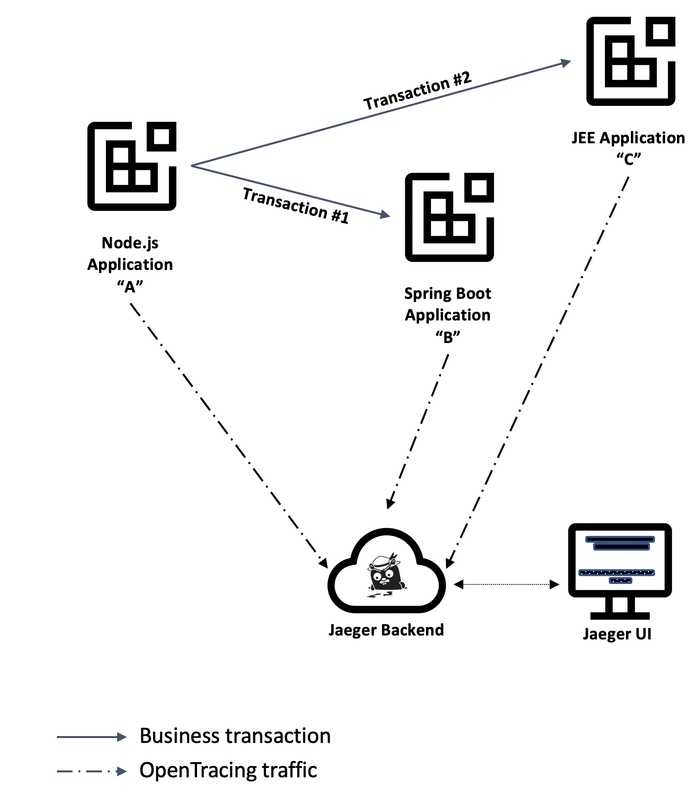
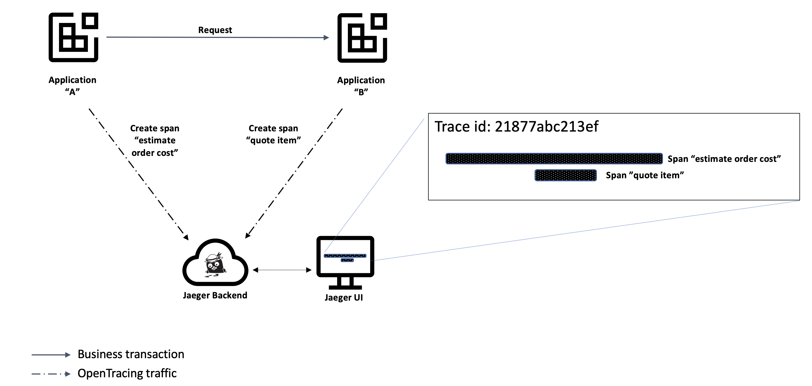
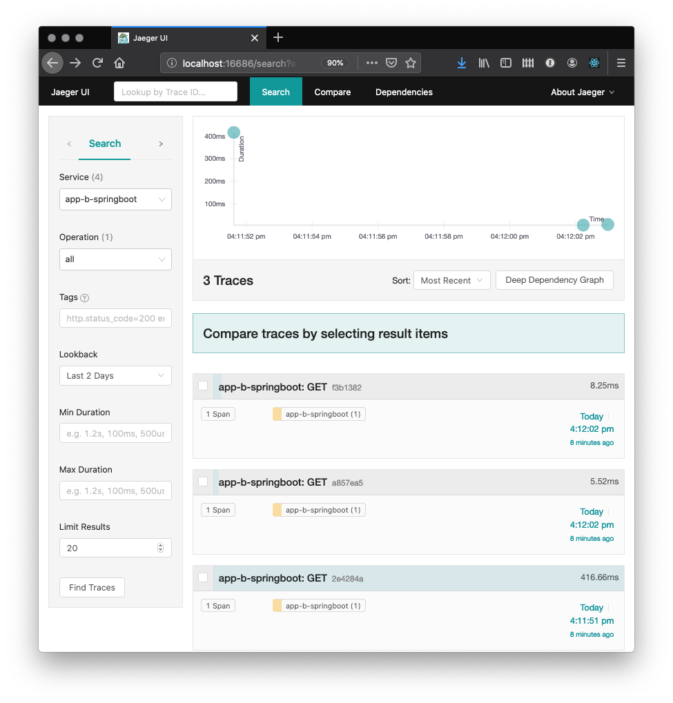

In this tutorial, you will build a small system containing various interconnected microservices and study the traffic inside that system. Traffic analysis is an essential activity in determining
the ideal partitioning of function amongst components of the architecture and is also
essential to understand the dynamics inside individual components.

This tutorial is meant for developers who are familiar with [Appsody](https://developer.ibm.com/blogs/introduction-to-appsody/) and with the concept of distributed tracing using [OpenTracing](https://opentracing.io/) APIs and the popular [Jaeger client libraries](https://www.jaegertracing.io/docs/latest/client-libraries/).

Appsody  is one of the upstream open source projects included in [IBM Cloud Pak for Applications] (https://www.ibm.com/cloud/cloud-pak-for-applications) and is used in this tutorial both as a way to expedite the creation of the microservices and also as a solution for introducimg instrumentation consistently across new applications.

At the end of the tutorial, you will have progressed from creating multiple microservices, instrumenting them for sending their telementry to a Jaeger backend (distributed tracing server) and studying the results in the the Jaeger UI:



This [GitHub repository](https://github.com/IBM/icpa-opentracing) contains a copy of the final application after completion of all steps, which you can use as a reference throughout the 
tutorial.


## Traces and spans in OpenTracing

This tutorial is not meant as a primer on distributed tracing or OpenTracing, but this section covers the key concepts used throughout the next sections. [The OpenTracing Semantic Specification](https://github.com/opentracing/specification/blob/master/specification.md) remains the authoritative source on all terms and their definitions.

### Core concepts

You are encouraged to read the OpenTracing specification before continuing, but if pressed for time, the three essential distributed tracing concepts are "traces" and "spans" and "references". At the most basic level, a "span" is the representation of a time-limited operation, whereas a "trace" is defined as an arbitrary collection of spans.

The other relevant concept is a "reference", which is used to represent the relationship between two spans.

The [OpenTracing Data Model section](https://github.com/opentracing/specification/blob/master/specification.md#the-opentracing-data-model) of the specification illustrates that arrangement both in terms of the relations between traces and spans, as well as their visualization in a timeline.

### A concrete example

In our example, consider an application "A" that receives a request from a web-browser, on behalf of user requesting the estimate for a purchase order.

Also consider how that application "A" may invoke application "B" to quote each individual item in the order.

That application "A" could report a span covering the entire operation to the Jaeger backend and also pass the identifier of that span to application "B", so that when application "B" decides to create spans to represent its own work associated with the operation, it can create a reference of type "children" between the new spans and the span created by application A".

The entire collection of spans created by both applications to represent that one transaction would be logically be grouped as a single trace in the Jaeger backend and presented as such in the Jaeger UI.

The next figure illustrates the arrangement between the components and the resulting "trace" in the Jaeger backend, with the horiz



### OpenTracing converging into OpenTelemetry

The field of distributed tracing tooling and instrumentation is changing rapidly with the convergence of [OpenTracing](https://opentracing.io/) into [OpenTelemetry](https://opentelemetry.io) . 

This tutorial is based on the (currently) more stable OpenTracing-based client libraries, but will be updated once OpenTelemetry client libraries become more widely available.

In the meantime, these are good references to learn more about the convergence roadmap and its implications to the Jaeger infrastructure used in this tutorial:

- [Merging OpenTracing and OpenCensus: A Roadmap to Convergence](https://medium.com/opentracing/a-roadmap-to-convergence-b074e5815289)
- [Jaeger and OpenTelemetry](https://medium.com/jaegertracing/jaeger-and-opentelemetry-1846f701d9f2)


## Prerequisites

* [Install Docker](https://docs.docker.com/get-started/).
  If using Windows or macOS, Docker Desktop is probably the best choice. If using a Linux system, [minikube](https://github.com/kubernetes/minikube) and its internal Docker registry is an alternative.

* [Install the Appsody CLI](https://appsody.dev/docs/getting-started/installation).

* Install Kubernetes. [minikube](https://github.com/kubernetes/minikube) will work on most platforms, but if using Docker Desktop, the internal Kubernetes enabled from the Docker Desktop Preferences (macOS) or Settings (Windows) panel is a more convenient alternative.


## Estimated time

With the prerequisites in place, you should be able to complete this tutorial in 1 hour.


## Steps

Following along to this tutorial, you will perform the following steps:

1. Setup local development environment
1. Create the Node.js application
1. Create the JEE application
1. Create the Spring boot application
1. Create the microservice dependencies
1. Examining tracing results
1. Istio service mesh
1. Tear down

These steps can be split into two major groups, first building and instrumenting the basic microservice applications, then progressing into a more complex deployment into an Istio service mesh.

Using a service mesh reflects a more common deployment topology for production environments, specially when using Appsody in combination with the other components of project Kabanero (the upstream open source project for IBM Cloud Pak for Applications).


## Step 1. Setup local development environment

You will start with a local [all-in-one Jaeger server](https://www.jaegertracing.io/docs/1.6/getting-started/) installation as you progress through the steps in this tutorial. 

This all-in-one server acts both as the backend for receiving the telemetry data from the various servers participating in a distributed transaction, as well as the host for the Jaeger UI console from where you can inspect the results of each transaction.


### Create a custom Docker network

This tutorial has many applications that need to locate each other via name lookups, which is easier when using a custom Docker network instead of the default bridge network.

Execute the following command from a command-line terminal:

```sh
docker network create opentrace_network
```

### Start a local Jaeger server

The instructions in the tutorial expect the all-in-one server to be named "jaeger-collector", which needs to be specified as the parameter when creating the container.

Type the following starting command from a command-line terminal, observing the presence of the `network` parameter cross-referencing the Docker network you just created:

```sh
docker run --name jaeger-collector \
  --rm \
  -e COLLECTOR_ZIPKIN_HTTP_PORT=9411 \
  -p 5775:5775/udp \
  -p 6831:6831/udp \
  -p 6832:6832/udp \
  -p 5778:5778 \
  -p 16686:16686 \
  -p 14268:14268 \
  -p 9411:9411 \
  --network opentrace_network \
  jaegertracing/all-in-one:latest
```

### Jaeger tracing options

The configuration for the Jaeger client libraries is well-documented in the [Client Library Features]](https://www.jaegertracing.io/docs/latest/client-features/) page of the Jaeger website and you will need to define a few of those properties.

Create a file for the Jaeger client properties, named `jaeger.properties`:

`jaeger.properties`
```properties
cat > jaeger.properties << EOF
JAEGER_ENDPOINT=http://jaeger-collector:14268/api/traces
JAEGER_REPORTER_LOG_SPANS=true
JAEGER_SAMPLER_TYPE=const
JAEGER_SAMPLER_PARAM=1
JAEGER_PROPAGATION=b3
EOF
```

There are few special notes about the contents of this configuration file:

- If you read through the [Jaeger architecture](https://www.jaegertracing.io/docs/latest/architecture/) page, the `JAEGER_ENDPOINT` variable instructs the client library to send span data directly to the Jaeger collector process instead of sending it to the intermediary agent process. This is an arbitrary decision for the purposes for this tutorial and has no impact on the final outcome in the Jaeger database. In a real production environment, there may be reasons to aggregate traffic through a Jaeger agent, but that discussion is outside the scope of this tutorial. 

- The combination of the `JAEGER_SAMPLER_TYPE` and `JAEGER_SAMPLER_PARAM` values is instructing the Jaeger client library to send every span to the Jaeger backend. This approach is appropriate for a tutorial where we want to inspect each request, but it may negatively affect the performance of the system in a real production environment. Refer to the Jaeger documentation on [sampling](https://www.jaegertracing.io/docs/sampling/) to make an informed decision about the ideal sampling settings for your environment.


## Step 2. Create the Node.js application

It is now time to create the Node.js application, once again using the Appsody command-line interface. Appsody supports both [Express](https://expressjs.com/) and [LoopBack](https://loopback.io/) frameworks and for this tutorial you will use the Express framework.

Type the following command in the command-line interface:

```sh
tutorial_dir=$(PWD)
mkdir nodejs-tracing
cd nodejs-tracing
appsody init incubator/nodejs-express
```

Take a moment to inspect the structure of the template application created by Appsody:

```
nodejs-tracing
├── app.js
├── package-lock.json
├── package.json
└── test
    └── test.js

```


### Assign a name to the application

Since you want to easily identify applications and microservices while inspecting a tracing span, the first modification to the application is to change the application name inside the newly generated `package.json` file.

Modify the line containing `"name": "nodejs-express-simple",` in `package.json` to this line instead:

```json
    "name": "app-a-nodejs",
```

### Enable OpenTracing using the Jaeger client library

For this section, you will follow instructions similar to those outlined in the [Jaeger documentation](https://github.com/jaegertracing/jaeger-client-node).

The first change is to include the `jaeger-client` package in your application, where you need to include the [package dependency](https://www.npmjs.com/package/jaeger-client) to the `package.json` file of the Node.js application, as follows:

```json
  "dependencies": {
    "jaeger-client": "^3.17.1"
  },
```

Node.js does not automatically instrument RESTful calls for tracing, so you need to make a few changes to the `app.js` file in order to initialize a tracer object that can be used in all calls to the distributed tracing backend.

1. Insert a global initialization block for an OpenTracing tracer object
2. Initiate a tracing span at the beginning of the request
3. Add the tracing statements inside the handler for the RESTful request being traced.


```js
module.exports = (/*options*/) => {
  // Use options.server to access http.Server. Example with socket.io:
  //     const io = require('socket.io')(options.server)
  const app = require('express')()

  //
  // Tutorial begin: Global initialization block
  //
  var initTracerFromEnv = require('jaeger-client').initTracerFromEnv;
  var config = {
    serviceName: 'app-a-nodejs',
  };
  var options = {
  };
  var tracer = initTracerFromEnv(config, options);
  //
  // Tutorial end: Global initialization block
  //
  
  app.get('/', (req, res) => {
    //
    // Tutorial begin: OpenTracing new span
    //
    const span = tracer.startSpan('http_request');
    //
    // Tutorial end: OpenTracing new span
    //

    // Use req.log (a `pino` instance) to log JSON:
    req.log.info({message: 'Hello from Appsody!'});
    res.send('Hello from Appsody!');

    //
    // Tutorial begin: Send span information to Jaeger
    //
    span.log({'event': 'request_end'});
    span.finish();
    //
    // Tutorial end: Send span information to Jaeger
    //
  });

  return app;
};
```

You can find more information about the `tracer` interface in the [OpenTracing API page](https://github.com/opentracing/opentracing-javascript/).


### Launch the application

With all modifications in places, it is time for you to launch the application and validate that it is instrumented for tracing distributed transactions.

Type the following command on a separate command-line window:

```sh
appsody run \
  --name "nodejs-tracing" \
  --docker-options="--env-file ../jaeger.properties" \
  --network opentrace_network 
```

Note the usage of the `network` parameter to place the container in the same custom Docker network created at the beginning of the tutorial.

You should see a message such as the one below indicating that the server is ready to accept requests:

`[Container] App started on PORT 3000`

Once you see the message, you should issue a few requests to the sample resource created along with the application.

```
curl http://localhost:3000
```

You can then launch the Jaeger UI in your browser of choice, by opening this URL:

http://localhost:16686

Choose the `app-a-nodejs` application in the Service menu and then click on the "Find Traces" button, which should display the transactions you initiated from the command-line:


## Step 2. Create the Spring Boot application

It is now time to create the Spring Boot application, once again using the Appsody command-line interface. Open another command-line terminal, switch it to the directory where you created the `jaeger.properties` file in the first step, then type the following command in the command-line interface:

```sh
mkdir springboot-tracing
cd springboot-tracing
appsody init incubator/java-spring-boot2
```

Before starting making modifications to the application, take a moment to inspect the template application created by Appsody:

```
springboot-tracing
├── mvnw
├── mvnw.cmd
├── pom.xml
└── src
    ├── main
    │   ├── java
    │   │   └── application
    │   │       ├── LivenessEndpoint.java
    │   │       └── Main.java
    │   └── resources
    │       ├── application.properties
    │       └── public
    │           └── index.html
    └── test
        └── java
            └── application
                └── MainTests.java
```


### Assign a name to the application

Since you want to easily identify this application while inspecting a tracing span, the first modification to the application is to change the application name inside the newly generated `pom.xml` file.

Modify the line containing `<artifactId>default-application</artifactId>` in `pom.xml` to this line instead:

```xml
    <artifactId>app-b-springboot</artifactId>
```

### Enable OpenTracing using Jaeger client

For this section, you will follow instructions simular to those outlined in the [Jaeger client library for Spring boot](https://github.com/opentracing-contrib/java-spring-jaeger) .

The first modification is to enable OpenTracing within the Spring Boot runtime, which requires a couple of localized changes to the`pom.xml` file

Insert the [Maven opentracing-spring-jaeger-cloud-starter dependency](https://mvnrepository.com/artifact/io.opentracing.contrib/opentracing-spring-jaeger-cloud-starter) inside the `<dependencies>` element of the `pom.xml` file:

```xml
    <dependency>
        <groupId>io.opentracing.contrib</groupId>
        <artifactId>opentracing-spring-cloud-starter</artifactId>
        <version>0.4.0</version>
    </dependency>

    <dependency>
        <groupId>io.opentracing</groupId>
        <artifactId>opentracing-api</artifactId>
        <version>0.33.0</version>
    </dependency>

    <dependency>
        <groupId>io.jaegertracing</groupId>
        <artifactId>jaeger-client</artifactId>
        <version>1.1.0</version>
    </dependency>
```


### Enable OpenTracing

The Jaeger client library needs to be initialized once in the source code, which you will perform in the Include the Jaeger client library in the Java source file located at `./src/main/java/application/Main.java` in the source tree.

Repeat the changes outlined in the fully modified example below to the `./src/main/java/application/Main.java` in the source tree for your Spring Boot application.

```java
package application;

import org.springframework.boot.SpringApplication;
import org.springframework.boot.autoconfigure.SpringBootApplication;

// 
// Tutorial: Begin import statements for Jaeger and OpenTracing
//
import org.springframework.context.annotation.Bean;
import io.jaegertracing.Configuration;
import io.opentracing.Tracer;
// 
// Tutorial: End import statements for Jaeger and OpenTracing
//

@SpringBootApplication
public class Main {

        // 
        // Tutorial: Begin initialization of OpenTracing tracer
        //
        @Bean
        public Tracer initTracer() {
          return Configuration.fromEnv("app-b-springboot").getTracer();
        }
        // 
        // Tutorial: End initialization of OpenTracing tracer
        //

        public static void main(String[] args) {
                SpringApplication.run(Main.class, args);
        }

}
```


### Launch the application

With the modification in place, it is time to launch the application and validate that it is instrumented for tracing distributed transactions.

Type the following command on a separate command-line window:

```sh
appsody run \
  --name springboot-tracing \
  --docker-options="--env-file ../jaeger.properties" \
  --network opentrace_network 
```

Note the usage of the `network` parameter again, placing the container in the same custom Docker network created at the beginning of the tutorial.

You should see a message such as the one below indicating that the server is ready to accept requests:

`[Container] ... INFO ... [  restartedMain] application.Main : Started Main...`

Once you see the message, you should issue a few requests to the application. Any URL will be sufficient for now as the goal is to validate that the enablement is working before we move on to creating new endpoints, so that you will use the `actuator` endpoint already pre-built into the application template.

Enter the following command in a command-line terminal and repeat it a few times.

```
curl http://localhost:8080/actuator
```

Now return to Jaeger UI (hosted at http://localhost:16686) in your browser. Note that you will need to refresh the browser screen to see the new service entry for the application (`app-b-springboot`) in the "Service" menu.

Choose the `app-b-springboot` application in the "Service" menu and then click on the "Find Traces" button, which will display the spans created as part of the transactions you initiated from the command-line:




## Step 4. Create the JEE application

As mentioned in the steps section, you will create a JEE application and instrument it with tracing capabilities.

Using the Appsody command-line interface makes the creation step quite simple, requiring a single command to create a working skeleton of a JEE application using the Open Liberty server. Open a new command-line terminal and switch to the directory where you creted the `jaeger.properties` file earlier in the tutorial, then type the following commands:

```sh
mkdir jee-tracing
cd jee-tracing
appsody init incubator/java-openliberty
```

Before making any modifications to the application, take a moment to inspect the template application created by Appsody:

```
java-openliberty
├── pom.xml
└── src
    ├── main
    │   ├── java
    │   │   └── dev
    │   │       └── appsody
    │   │           └── starter
    │   │               ├── StarterApplication.java
    │   │               ├── StarterResource.java
    │   │               └── health
    │   │                   ├── StarterLivenessCheck.java
    │   │                   └── StarterReadinessCheck.java
    │   ├── liberty
    │   │   └── config
    │   │       └── server.xml
    │   └── webapp
    │       ├── WEB-INF
    │       │   └── beans.xml
    │       └── index.html
    └── test
        └── java
            └── it
                └── dev
                    └── appsody
                        └── starter
                            └── HealthEndpointTest.java
```


### Assign a name to the application

Since you want to easily identify this application while inspecting a tracing span, the first modification to the application is to change the application name inside the newly generated `pom.xml` file.

Modify the line containing `<artifactId>starter-app</artifactId>` in `pom.xml` to this line instead:

```xml
    <artifactId>app-c-jee</artifactId>
```

### Enable OpenTracing using Jaeger client

The next modification is to enable OpenTracing within the Open Liberty runtime, which requires a couple of localized changes to both the `pom.xml` and `src/main/liberty/config/server.xml` files.

The nature of these changes is explained in a bit more in the [Open Liberty blog entry announcing the support of Jaeger as a tracing backend](https://openliberty.io/blog/2019/12/06/microprofile-32-health-metrics-190012.html#jmo).

The first change is to include the [Jaeger Java client library](https://github.com/jaegertracing/jaeger-client-java) dependency in the final application. If you look at the Open Liberty documentation, it will instruct you to create a new shared library available to all applications running inside the container, but that level of complexity is unnecessary for the microservice created in this tutorial, since there will be a single application inside that server.

Insert the [Maven jaeger-client dependency](https://mvnrepository.com/artifact/io.jaegertracing/jaeger-client) XML element inside the `<dependencies>` element of the `pom.xml` file:

```xml
        <dependency>
            <groupId>io.jaegertracing</groupId>
            <artifactId>jaeger-client</artifactId>
            <version>0.34.0</version>
        </dependency>
```

Note that this version of the Jaeger client library, while not the latest version, is the version tested with the version of Open Liberty bundled in the Appsody `java-openliberty` stack at the time this tutorial was written. See notes in the [Troubleshooting](#troubleshooting) section about common problems experienced while attempting to use different versions.

The next step is to add the OpenTracing feature to the Open Liberty server. Add the following element inside the `featureManager` section of the `src/main/liberty/config/server.xml` file:

```xml
        <feature>mpOpenTracing-1.3</feature>
```

Replace the `webApplication` element in the `src/main/liberty/config/server.xml` file with this snippet:

```xml
    <webApplication location="app-c-jee.war" contextRoot="/" >
        <classloader apiTypeVisibility="+third-party" />
    </webApplication>
```

And this is all that there is to it in terms of basic enablement, with the Open Liberty stack offering a solid baseline for distributed tracing, with every remote request being instrumented without code changes.

That default behavior can be altered through Java annotations present in the [Eclipse MicroProfile OpenTracing specification](https://github.com/eclipse/microprofile-opentracing/blob/master/spec/src/main/asciidoc/microprofile-opentracing.asciidoc), some of which will be explored later in the tutorial.


### Launch the application

With the modifications to the `pom.xml` and `server.xml` files in place, it is time to launch the application and validate that it is instrumented for tracing distributed transactions.

Type the following command on a separate command-line window:

```sh
appsody run \
  --name jee-tracing \
  --publish "9444:9443" \
  --docker-options="--env-file ../jaeger.properties" \
  --network opentrace_network 
```

Once again, notice the `network` parameter to place the container in the same custom Docker network created at the beginning of the tutorial. You can inspect the other Jaeger configuration parameters in the [Jaeger documentation for the Java client library](https://github.com/jaegertracing/jaeger-client-java/blob/master/jaeger-core/README.md).

Also notice the usage of the `--publish` parameter to export port 9444 instead of 9443 to the localhost. This change is required to bypass a common network port conflict in the development environments where Docker has the Kubernetes cluster enabled and using port 9443.

You should see a message such as the one below indicating that the server is ready to accept requests:

```
[Container] [INFO] [AUDIT   ] CWWKF0011I: The defaultServer server is ready to run a smarter planet...
...
[Container] [INFO] Integration tests finished.
```

Once you see the message, you should issue a few requests to the sample resource created along with the application.

```
curl http://localhost:9080/starter/resource
```

Now return to Jaeger UI (hosted at http://localhost:16686) in your browser. You will need to refresh the browser screen to see the new service entry for the application (`app-c-jee`).

Choose the `app-c-jee` application in the Service menu and then click on the "Find Traces" button again, which should display the transactions you initiated from the command-line:


## Step 5. Create the microservice dependencies

At this point in the tutorial you have the 3 standalone microservices running and enabled for sending their tracing information to the Jaeger all-in-one server. Now you can proceed to create the dependencies between these microservices, materializing the microservices topology depicted at the beginning of the tutorial.


### Service endpoint in the Open Liberty application

This new endpoint implements a typical JAX-RS REST resource, with the addition of OpenTracing API calls to create spans while the request is being processed. One of the spans is implict in the invocation of the external REST handler, while a couple of others are created explicitly inside that method to illustrate the full potential of distributed tracing bridging together both inter-process and intra-process spans of an entire distributed transaction.

Create a new Java class named `ServiceResource.java` in the `src/main/java/dev/appsody/starter` folder of the Spring Boot application, containing the source code:

```java
package dev.appsody.starter;

import javax.inject.Inject;
import javax.json.Json;
import javax.json.JsonObject;
import javax.ws.rs.GET;
import javax.ws.rs.Path;
import javax.ws.rs.Produces;
import javax.ws.rs.core.Context;
import javax.ws.rs.core.HttpHeaders;
import javax.ws.rs.core.MediaType;
import javax.ws.rs.core.MultivaluedMap;
import javax.ws.rs.core.Response;

import io.opentracing.Scope;
import io.opentracing.Tracer;
import io.opentracing.tag.Tags;

@Path("/service")
public class ServiceResource {

    @Inject
    Tracer tracer;

    @GET
    @Produces(MediaType.APPLICATION_JSON)
    public Response completeOrder(JsonObject orderPayload, @Context HttpHeaders httpHeaders) {
        try (Scope childScope = tracer.buildSpan("phase_1").startActive(true)) {
            MultivaluedMap<String, String> requestHeaders = httpHeaders.getRequestHeaders();
            requestHeaders.forEach((k, v) -> System.out.println(k + ":" + v.toString()));
            System.out.println(orderPayload);
            System.out.println("baggage item: " + tracer.activeSpan().getBaggageItem("baggage"));
        }

        try (Scope childScope = tracer.buildSpan("phase_2").startActive(true)) {
            double orderTotal = orderPayload.getJsonNumber("total").doubleValue();
            if (orderTotal > 6000) {
                childScope.span().setTag(Tags.ERROR.getKey(), true);
                childScope.span().log("Order value " + orderTotal + " is too high");
            }
            // Simulation of long stretch of work
            Thread.sleep(60);
        } catch (InterruptedException e) {
            // no-op
        }

        JsonObject response = Json.createObjectBuilder().add("status", "completed")
                .add("order", orderPayload.getString("order")).build();
        return Response.ok(response).build();
    }
}

```

There is no need to take action on the `appsody run` command already running the application, since `appsody` will automatically detect the new code changes, recompile the application, and then restart it with the new code within the same container.

Monitor the log entries in the terminal where the application was started.


### Create service endpoint in the Sprint Boot application

This endpoint is similar in concept to the endpoint created for the Open Liberty application, with the expected adaptations of REST annotations to match the Spring Boot programming model. Once again, one of the spans is implict in the invocation of the external REST handler, while a couple of others are created explicitly inside the handler.

Create a new Java class named `ServiceResource.java` in the `src/main/java/application` folder of the Spring Boot application, containing the following source code:

```java
package application;

import java.util.Map;
import java.util.Random;

import org.springframework.beans.factory.annotation.Autowired;
import org.springframework.http.HttpHeaders;
import org.springframework.http.MediaType;
import org.springframework.http.ResponseEntity;
import org.springframework.web.bind.annotation.GetMapping;
import org.springframework.web.bind.annotation.RequestBody;
import org.springframework.web.bind.annotation.RequestHeader;
import org.springframework.web.bind.annotation.RestController;

import io.opentracing.Span;
import io.opentracing.Tracer;
import io.opentracing.tag.Tags;

@RestController
public class ServiceResource {

    @Autowired
    private Tracer tracer;

    @GetMapping(value = "/resource", consumes = "application/json", produces = "application/json")
    public ResponseEntity<Object> quoteItem(@RequestBody Map<String, Object> quotePayload,
        @RequestHeader HttpHeaders  httpHeaders) {

        Span parentSpan = tracer.scopeManager().activeSpan();
        Span spanPhase1 = tracer.buildSpan("phase_1").asChildOf(parentSpan).start();
        try {
            httpHeaders.forEach((k, v) -> System.out.println(k + ":" + v.toString()));
            quotePayload.forEach((k, v) -> System.out.println(k + ":" + v.toString()));
            System.out.println("baggage:" + parentSpan.getBaggageItem("baggage"));
        } finally {
            spanPhase1.finish();
        }

        Span spanPhase2 = tracer.buildSpan("phase_2").asChildOf(parentSpan).start();
        try {
            int orderTotal = (Integer) quotePayload.getOrDefault("count", 0);
            if (orderTotal > 7) {
                spanPhase2.setTag(Tags.ERROR.getKey(), true);
                spanPhase2.log("Out of stock for item " + quotePayload.get("itemId"));
            }
            try {
                // Simulate long stretch of work
                Thread.sleep(60);
            } catch (InterruptedException e) {
                // no-op
            }
        } finally {
            spanPhase2.finish();
        }

        return ResponseEntity
          .ok().contentType(MediaType.APPLICATION_JSON)
          .body("{ \"quote\", " + new Random().nextFloat() + " }");
    }
}
```

### Create the top-level service endpoint in the Node.js application

Recalling the original goal of this tutorial, it is time to create the top-level service endpoints in the Node.js application, which will make the down-stream calls to the other applications.

As a first step, you will modify the `dependencies` element created earlier in the `package.json` file and include the other Node.js packages required in the actual service endpoint source code.

Modify the `dependencies` element in `package.json` so that it looks like this:

```json
  "dependencies": {
    "jaeger-client": "^3.17.1",
    "opentracing": "latest",
    "request-promise": "^4.2.0",
    "uuid-random": "latest"
  },
```

Until [GitHub issue #583](https://github.com/appsody/stacks/issues/583) is addressed, Appsody does not automatically restart Node.js applications upon changes to the `package.json` file, so you will need to manually stop the application, by pressing the combination of the "Ctrl+C" keys in the command-line terminal from where you started the Node.js application.

Once the application is stopped, reissue the `appsody start` command from that same terminal:

```sh
appsody run \
  --docker-options="--env-file ../jaeger.properties" \
  --network opentrace_network 
```

Now create a new file named `serviceBroker.js` in the same directory where you created the Node.js project, with the following contents:

```js
// serviceBroker.js
// ================

const request = require('request-promise');
const { Tags, FORMAT_HTTP_HEADERS } = require('opentracing');

var serviceTransaction = function(serviceCUrl, servicePayload, parentSpan) {
    const tracer = parentSpan.tracer();
    const span = tracer.startSpan("service", {childOf: parentSpan.context()});
    var callResult = callService(serviceCUrl, servicePayload, span)
        .then( data => {
            span.setTag(Tags.HTTP_STATUS_CODE, 200)
            span.finish();
        })
        .catch( err => {
            console.log(err);
            span.setTag(Tags.ERROR, true)
            span.setTag(Tags.HTTP_STATUS_CODE, err.statusCode || 500);
            span.finish();
        });
    return callResult;
}

async function callService(serviceCUrl, servicePayload, parentSpan) {
    const tracer = parentSpan.tracer();
    const url = serviceCUrl;
    const body = servicePayload

    const span = parentSpan;
    const method = 'GET';
    const headers = {};
    span.setTag(Tags.HTTP_URL, serviceCUrl);
    span.setTag(Tags.SPAN_KIND, Tags.SPAN_KIND_RPC_CLIENT);
    span.setBaggageItem("baggage", true);
    tracer.inject(span, FORMAT_HTTP_HEADERS, headers);

    var serviceCallOptions = {
        uri: url,
        json: true,
        headers: headers,
        body: servicePayload
    };
    try {
        const data = await request(serviceCallOptions);
        span.finish();
        return data;
    }
    catch (e) {
        span.finish();
        throw e;
    }

}

module.exports = serviceTransaction;
```

This service call creates a distributed tracing span to delimit an outbound call to a remote application. Notice the [tracer.inject](https://opentracing-javascript.surge.sh/classes/tracer.html#inject) call before that outbound call, populating the HTTP headers so that the span context is propagated to the remote application. 

The modifications are somewhat spread out across the file, so it is easier to replace the entire contents of `app.js` file with the content below, taking a moment to inspect the code blocks between "Tutorial begin" and "Tutorial end" comments to understand the purpose of the changes:


```js
module.exports = (/*options*/) => {
  // Use options.server to access http.Server. Example with socket.io:
  //     const io = require('socket.io')(options.server)
  const app = require('express')()

  //
  // Tutorial begin: Remote requests to other applications
  //
  const uuid = require('uuid-random')
  const serviceTransaction = require('./serviceBroker.js')
  //
  // Tutorial end: Remote requests to other applications
  //
  
  //
  // Tutorial begin: OpenTracing initialization
  //
  const opentracing = require('opentracing')
  var initTracerFromEnv = require('jaeger-client').initTracerFromEnv
  var config = { serviceName: 'app-a-nodejs' }
  var options = {}
  var tracer = initTracerFromEnv(config, options)
  
  // This block is required for compatibility with the service meshes 
  // using B3 headers for header propagation
  // https://github.com/openzipkin/b3-propagation
  const ZipkinB3TextMapCodec = require('jaeger-client').ZipkinB3TextMapCodec
  let codec = new ZipkinB3TextMapCodec({ urlEncoding: true });
  tracer.registerInjector(opentracing.FORMAT_HTTP_HEADERS, codec);
  tracer.registerExtractor(opentracing.FORMAT_HTTP_HEADERS, codec);

  opentracing.initGlobalTracer(tracer)
  //
  // Tutorial end: OpenTracing initialization
  //
  
  app.get('/', (req, res) => {
    // Use req.log (a `pino` instance) to log JSON:
    req.log.info({message: 'Hello from Appsody!'})
    res.send('Hello from Appsody!')
  })

  // Tutorial begin: Transaction A-B 
  app.get('/node-springboot', (req, res) => {
    const baseUrl = 'http://springboot-tracing:8080'
    const serviceCUrl = baseUrl + '/resource'
    const spanName = 'http_request_ab'
 
    // https://opentracing-javascript.surge.sh/classes/tracer.html#extract
    const wireCtx = tracer.extract(opentracing.FORMAT_HTTP_HEADERS, req.headers)
    const span = tracer.startSpan(spanName, { childOf: wireCtx })
    span.log({ event: 'request_received' })

    const payload = { 'itemId': uuid(), 'count': Math.floor(1 + Math.random() * 10)}
    serviceTransaction(serviceCUrl, payload, span)
      .then(() => {
        const finishSpan = () => {
          span.log({'event': 'request_end'})
          span.finish()
        }

        res.on('finish', finishSpan)

        req.log.info({message: spanName})
        res.send(payload)
      })
  })
  // Tutorial end: Transaction A-B

  // Tutorial begin: Transaction A-C
  app.get('/node-jee', (req, res) => {
    const baseUrl = 'http://jee-tracing:9080'
    const serviceCUrl = baseUrl + '/starter/service'
    const spanName = 'http_request_ac'

    const wireCtx = tracer.extract(opentracing.FORMAT_HTTP_HEADERS, req.headers)
    const span = tracer.startSpan(spanName, { childOf: wireCtx })
    span.log({ event: 'request_received' })

    const payload = { 'order': uuid(), 'total': Math.floor(1 + Math.random() * 10000)}
    serviceTransaction(serviceCUrl, payload, span)
      .then(() => {
        const finishSpan = () => {
          span.log({'event': 'request_end'})
          span.finish()
        }

        res.on('finish', finishSpan)

        req.log.info({message: spanName})
        res.send(payload)
      })
  })
  // Tutorial end: Transaction A-C

  return app
}
```

As you create the new `serviceBroker.js` file and replace the contents of `app.js`, notice how Appsody restarts the application automatically to reflect the changes in the actual service.

The previous steps is concludes the creation of the microservices in the small distributed architecture proposed at the beginning of the tutorial, so you can proceed to validate the results and interact with the tracing data generated as a byproduct of business transactions.

### Visualizing the distributed transactions

Issue multiple requests to the new endpoints, repeating the following commands a few times from the command-line terminal:

```
curl -s http://localhost:3000/node-jee
curl -s http://localhost:3000/node-springboot
```

Now go back to the [Jaeger UI](http://localhost:16686) to inspect the new traces. Select `app-a-nodejs` from the "Service" menu and click on the "Find Traces" button.

You should see a trace for each of the requests issued from the command line.


Now click on one of the trace entries, preferably one tagged with `1 Error`, which is set within the service endpoints depending on the values in the input values for the request. Take a couple of moments to expand the span segments and inspect their contents.


### Inspecting HTTP headers for distributed tracing

You can also take a closer look at the output of both microservices and see the tracing HTTP headers passed from the source application.

The terminal window for the Spring Boot application should contain output similar to this for each request, with possibly different orders for the fields:

```
[Container] x-b3-traceid:[d9fb3e70bfecee44]
[Container] x-b3-parentspanid:[d9fb3e70bfecee44]
[Container] x-b3-spanid:[958c39d355a34341]
[Container] x-b3-sampled:[1]
[Container] uberctx-baggage:[true]
[Container] host:[springboot-tracing:8080]
[Container] accept:[application/json]
[Container] content-type:[application/json]
[Container] content-length:[59]
[Container] connection:[close]
```

The terminal window for the Open Liberty application should contain output similar to this for each request, with possibly different orders for the fields:

```
[Container] [INFO] Accept:[application/json]
[Container] [INFO] connection:[close]
[Container] [INFO] Content-Length:[61]
[Container] [INFO] content-type:[application/json]
[Container] [INFO] Host:[jee-tracing:9080]
[Container] [INFO] uberctx-baggage:[true]
[Container] [INFO] x-b3-parentspanid:[a2e3fee65e0826c7]
[Container] [INFO] x-b3-sampled:[1]
[Container] [INFO] x-b3-spanid:[c3324648c101b7c9]
[Container] [INFO] x-b3-traceid:[a2e3fee65e0826c7]
```


### Tearing down the installation

Use the following commands from a command-line terminal to stop all running processes created up to this point in the tutorial and then remove resources created by these processes:

```sh
appsody stop --name nodejs-tracing
appsody stop --name springboot-tracing
appsody stop --name jee-tracing
docker stop jaeger-collector
docker network rm opentrace_network
```


## Step 6. Istio service mesh

The full potential of microservices relies on flexibility and resilience in the communications, so that new services or new versions of existing services can be introduced and removed without negative impacts to the overall system.

Service meshes such as [Istio](https://istio.io) are commonly paired with microservices to intermediate traffic amongst them, injecting functionality such as load balancing, security, and automatic generation of traffic metrics.

If you are new to service meshes and want to learn more about them before proceeding, [this overview](https://www.redhat.com/en/topics/microservices/what-is-a-service-mesh) is a good starting point, whereas the [Istio Concepts](https://istio.io/docs/concepts/what-is-istio/) page expands those concepts into a more detailed view of Istio capabilities. If you want to dive even deeper into service meshes after you complete this tutorial, you can try these guided [Service Mesh labs](https://learn.openshift.com/servicemesh/), with hands-on exercises ranging from basic to advanced lessons.


### Deploying the service mesh

This tutorial uses Istio as the service mesh for the microservices architecture completed in the previous steps.

Thanks to the "side-car" architecture pattern, also used in Istio, a new traffic intermediation container is added to each pod running a service, which means microservices do not require alterations to benefit from the service mesh functionality.

The next steps assume the usage of the Istio "Demo" profile added on top of minikube or the Kubernetes cluster bundled with Docker Desktop . It is possible to use other providers, but installation of everything present in the Istio "Demo" profile may be quite involved and are outside the scope of thius tutorial.

Assuming you will follow the recommendation of using minikube or the Kubernetes cluster bundled with Docker Desktop, proceed with the [Istio installation instructions](https://istio.io/docs/setup/getting-started/) , which are summarized below:


```
curl -L https://istio.io/downloadIstio | sh -

export PATH="$PATH:$(PWD)/istio-1.4.4/bin"

istioctl verify-install

istioctl manifest apply  --set profile=demo --set values.tracing.enabled=true --set values.kiali.enabled=true
```

The output shoud look similar to the one below

```
- Applying manifest for component Base...
✔ Finished applying manifest for component Base.
- Applying manifest for component Tracing...
- Applying manifest for component Citadel...
- Applying manifest for component Policy...
- Applying manifest for component Prometheus...
- Applying manifest for component Kiali...
- Applying manifest for component EgressGateway...
- Applying manifest for component IngressGateway...
- Applying manifest for component Pilot...
- Applying manifest for component Galley...
- Applying manifest for component Telemetry...
- Applying manifest for component Injector...
- Applying manifest for component Grafana...
✔ Finished applying manifest for component Citadel.
✔ Finished applying manifest for component Prometheus.
✔ Finished applying manifest for component Kiali.
✔ Finished applying manifest for component Galley.
✔ Finished applying manifest for component Tracing.
✔ Finished applying manifest for component Injector.
✔ Finished applying manifest for component Policy.
✔ Finished applying manifest for component Pilot.
✔ Finished applying manifest for component EgressGateway.
✔ Finished applying manifest for component IngressGateway.
✔ Finished applying manifest for component Grafana.
✔ Finished applying manifest for component Telemetry.
```

### Create the namespace for the microservices

The tutorial will create a number of resources in the target cluster and it is beneficial to keep that content separate from other resources you may already have in the container.

You will create a new namespace for this tutorial, named `tracing`, typing the following commands in a command-line terminal:

```sh
kubectl create namespace tracing
```

### Making the Jaeger collector reachable across namespaces

Once the installation is complete, you should be able to see all content created by Istio installation by typing the following command into a terminal:

```sh
kubectl get all -n istio-system
```

The output of that command shows all Deployments, ReplicaSets, Pods, and Services supporting Istio. Note this particular `Service` entry in the output:

```
service/jaeger-collector         ClusterIP   ...
```

The instructions in this tutorial place the microservices on the `default` namespace, which is different than the `istio-system` namespace where `jaeger-collector` resides. Therefore, we want Kubernetes to map any references to `jaeger-collector` in the `default` namespace towards the actual service running in the `istio-system` namespace.

Following the [Kubernetes DNS naming resolution scheme](https://kubernetes.io/docs/concepts/services-networking/dns-pod-service/), you can realize the resulting hostname for the Jaeger collector to be `jaeger-collector.istio-system.svc.cluster.local`. Hardcoding that hostname in the configuration of all microservices is not a good idea since it would introduce a hard dependency on the service mesh architecture and topology, so the better approach is to create a `Service` instance with the type [ExternalName](https://kubernetes.io/docs/concepts/services-networking/service/#externalname) .

Type the following commands on a command-line terminal in order to create that `Service` instance:

```sh
cat <<EOF | kubectl apply -n default -f -
kind: Service
apiVersion: v1
metadata:
  name: jaeger-collector
spec:
  type: ExternalName
  externalName: jaeger-collector.istio-system.svc.cluster.local
  ports:
  - port: 14268
EOF
```

Notice the usage of `namespace: tracing

### Create the Docker images

As a first step prior to deployment of the microservices, you will request the build of the Docker images for each of the microservices. For this step, you can reuse the command-line terminals from the first part of this tutorial or create new ones. 

Assuming the environment variable `tutorial_dir` was set to the directory where you first started the tutorial and created the `jaeger.properties` file, type the following commands from the command-line terminal:

```sh
cd "${tutorial_dir}"
cd nodejs-tracing
appsody build
```

```sh
cd "${tutorial_dir}"
cd springboot-tracing
appsody build
```

```sh
cd "${tutorial_dir}"
cd jee-tracing
appsody build
```

Once all image builds are complete, inspect the output of the following command:

```sh
docker images dev.local/*
```

This command should result in an output similar to this:

```
REPOSITORY                     TAG                 IMAGE ID            CREATED             SIZE
dev.local/nodejs-tracing       latest              597adcbeb47e        3 minutes ago       192MB
dev.local/springboot-tracing   latest              c2ccb43475e1        4 minutes ago       412MB
dev.local/jee-tracing          latest              138f3c5276d6        4 minutes ago       708MB
```

Additionally, you will also find a new `app-deploy.yaml` file at the root of each respective project.
This deployment file contains an `AppsodyApplication` definition, which is documented in detail in the [Appsody Operator GitHub page](https://github.com/appsody/appsody-operator/tree/master/doc).

This tutorial will have small and instructions for modifications to the file, but you can refer to the [Appsody Operator User Guide](https://github.com/appsody/appsody-operator/blob/master/doc/user-guide.md) if you plan on further customizing the deployment of the microservices.


### Create application configuration

[Create a ConfigMap](https://kubernetes.io/docs/tasks/configure-pod-container/configure-pod-configmap/#create-a-configmap) with the Jaeger configuration settings added to `jaeger.properties` earlier in this tutorial:

```sh
kubectl create configmap jaeger-config -n tracing --from-env-file=jaeger.properties

kubectl get configmap jaeger-config -n tracing -o yaml
```

Add the new ConfigMap to the application, inserting the `envFrom` snippet to the `app-deploy.yaml` file for each application:

```yaml
spec:
...
  envFrom:
  - configMapRef:
      name: jaeger-config
  ...
```


### Configure sidecar injection

An Istio sidecar is a proxy added by Istio throughout the environment to intercept the communication betweeen microservices before exercising its traffic management functions. You can read more about all the available [Istio sidecar configuration](https://istio.io/docs/reference/config/networking/sidecar/), but for the purposes of this tutorial, we are interested in the proxy's ability to add tracing instrumentation to the application in the pod.

There are two ways to inject the Istio sidecar to an application:

1. Using the `istio kube-inject` command
2. Enabling automatic injection of sidecars to all applications added to a namespace

The second alternative is more approachable for this tutorial, since it requires less commands on the terminal. You can still turn off the injection on individual applications by adding the following annotation to the `app-deploy.yaml` file.

Enabling automatic injection is described in the [Installing the Sidecar](https://istio.io/docs/setup/additional-setup/sidecar-injection/) section of the Istio documentation. The takeaway is that you need to add the label `istio-injection=enabled` to the namespace where you want automatic injection of the sidecar, so type the following instructions in the command-line:

```sh
kubectl label namespace tracing istio-injection=enabled
```

You can verify the results of this 
```sh
kubectl get namespace -L istio-injection
```

Add the `sidecar.istio.io/inject` annotation to the `metadata.annotations` section of the `app-deploy.yaml` file for each application. 

```yaml
metadata:
  annotations:
    ...
    sidecar.istio.io/inject: "true"
    ...
  ...
...
```

Notice how you could set the `sidecar.istio.io/inject` annotation to `"false"` to turn off the injection for an individual application even when automatic injection is enabled for the target namespace.

Optionally, replace the `service.type` value from `NodePort` to `ClusterIP` in `app-deploy.yaml`. This will remove the external port for the microservice, which ensures no one accidentally bypasses the Istio traffic management.


### Labeling the workload

Istio has a number of optional labels that can be quite useful to further categorize metrics, specially when visualizing the data from the Kiali console.

These labels are defined in the [Pods and Services](https://istio.io/docs/ops/deployment/requirements/) page of the Istio documentation. Add the following labels to the `app-deploy.yaml` file for the `nodejs-tracing` application:

```yaml
metadata:
  ...
  labels:
     app: nodejs-tracing
     version: v1
     ...
...
```


### Deploy the microservices

As a summary up to this point, you have made the following changes to your cluster and to the deployment descriptor of each application:

- Created a namespace (`tracing`) for deploying the applications

- Enabled that namespace for automatic Istio sidecar injection

- Created a `ConfigMap` resource containing the Jaeger endpoint information

- Added an `envFrom` entry to reference the `ConfigMap` resource in the `app-deploy.yaml` deployment descriptor for each application 

- Added a `sidecar.istio.io/inject` annotation to the `service` in the `app-deploy.yaml` deployment descriptor for each application

With all those changes in place, and ssuming the environment variable `tutorial_dir` is set to the directory where you first started the tutorial, type the following commands from the command-line terminal:

```sh
cd "${tutorial_dir}"
cd nodejs-tracing
appsody deploy --namespace tracing
```

```sh
cd "${tutorial_dir}"
cd springboot-tracing
appsody deploy --namespace tracing
```

```sh
cd "${tutorial_dir}"
cd jee-tracing
appsody deploy --namespace tracing
```

In concrete terms, the sidecar is added as a container to the Pod running the microservices, which makes this a good point to take a look at the running containers before the injection. Type the following instruction in the command-line terminal:

```sh
kubectl get pods -n tracing -l app.kubernetes.io/managed-by=appsody-operator
```

You should see output similar to the one below, with a two containers inside each pod, which indicates the sidecar has been added:

```
NAME                                  READY   STATUS    ...
jee-tracing-6cd5784b57-hm65c          2/2     Running   ...
nodejs-tracing-5cf9f655db-kl4gl       2/2     Running   ...
springboot-tracing-5f7b7fb74f-hzxl5   2/2     Running   ...
```


### Note about sidecar injection at the application level

The previous sections enabled sidecar injection for all deployments in a namespace. There may be good reasons to avoid introducing that default behavior and apply instrumentation of individual applications. Just in the way of a reference, this is how you would instrument an Appsody-based application with an Istio sidecar after it has been deployed:

```sh
application_name=<<name of your Appsody application, such as "nodejs-tracing" >>
kubectl get deployment $application_name  -o yaml | istioctl kube-inject -f - | kubectl apply -f -
```

Note that `kube-inject` command modifies the deployment descriptor directly in the cluster, leaving the original `app-deploy.yaml` file unmodified. Future invocations of `appsody deploy` will overwrite those modifications.


### (Optional) Tail microservices logs

You can type the following commands in three separate terminal windows to follow the console output of each application as you progress towards the rest of the tutorial:

```sh
kubectl logs -n tracing -f -l app.kubernetes.io/name=nodejs-tracing --all-containers | grep -vi "live\|ready\|inbound\|metrics"
```

```sh
kubectl logs -n tracing -f -l app.kubernetes.io/name=springboot-tracing --all-containers | grep -vi "live\|ready\|inbound"
```

```sh
kubectl logs -n tracing -f -l app.kubernetes.io/name=jee-tracing --all-containers | grep -vi "live\|ready\|inbound"
```


### Create ingress routes for the top-level application

As the final step before sending transactions into the Node.js microservice, you need to configure Istio Gateway and VirtualService resources to route traffic to the application:


```sh
cat <<EOF | kubectl apply -n tracing -f -
apiVersion: networking.istio.io/v1alpha3
kind: Gateway
metadata:
  name: tracing-tutorial-gateway
spec:
  selector:
    istio: ingressgateway # use istio default controller
  servers:
  - port:
      number: 80
      name: http
      protocol: HTTP
    hosts:
    - "*"
---
apiVersion: networking.istio.io/v1alpha3
kind: VirtualService
metadata:
  name: tracing-tutorialinfo
spec:
  hosts:
  - "*"
  gateways:
  - tracing-tutorial-gateway
  http:
  - match:
    - uri:
        exact: /node-springboot
    - uri:
        exact: /node-jee
    route:
    - destination:
        host: nodejs-tracing
        port:
          number: 3000
EOF
```

Note the presence of the `/node-springboot` and `/node-jee` virtual endpoints in the `VirtualService`, which map to the respective endpoints in the Node.js application.

Now issue the following commands a few times:

```sh
curl localhost/node-springboot
curl localhost/node-jee
```


### Inspect dashboard contents

```sh
istioctl dashboard jaeger
```


### Tear down the deployment

Remove all applications from the cluster by typing the following instruction from the directory containing each application:

```sh
cd "${tutorial_dir}"
cd nodejs-tracing ;     appsody deploy delete
cd springboot-tracing ; appsody deploy delete
cd jee-tracing ;        appsody deploy delete
```

Alternatively, you can also remove the Appsody-based microservices by using the `kubectl` command to delete the `AppsodyApplication` for that microservie, typing the following instructions on a command-line terminal:

```sh
kubectl delete AppsodyApplication nodejs-tracing
kubectl delete AppsodyApplication springboot-tracing
kubectl delete AppsodyApplication jee-tracing
```

If you deployed Istio as part of this tutorial, you can remove it from your cluster by typing the following instructions on a command-line terminal:

```sh
kubectl delete namespace istio-system
```


## Next steps

- Further explore the [Istio Telemetry Addons](https://istio.io/docs/tasks/observability/gateways/)

- You can try these hands-on [service mesh labs](https://learn.openshift.com/servicemesh/), which contains a good list of basic and advanced lessons.


## Troubleshooting

### Choosing different Jaeger client for java-openliberty stack

The Jaeger client depends on the OpenTracing libraries bundled with Open Liberty, which in turn is the core of the Appsody java-openliberty stack. At the time of the writing for this tutorial, the [recommended version](https://openliberty.io/blog/2019/12/06/microprofile-32-health-metrics-190012.html#jmo) is 0.34.0.

As the application code evolves, it is a good development practice to pick later versions of dependency libraries, but beware of these common problems when the Jaeger client version has conflicts with the OpenTracing libraries bundled with Open Liberty.

For instance, version 0.35.0 of the Jaeger client is incompatible with Open Liberty 19.0.0.12. The symptom are failed RESTful requests accompanied from this message.

`Error 500: java.lang.NoSuchMethodError: io/opentracing/ScopeManager.activeSpan&#40;&#41;Lio/opentracing/Span&#59; &#40;loaded from file:/opt/ol/wlp/lib/../dev/api/third-party/com.ibm.websphere.appserver.thirdparty.opentracing.0.31.0_1.0.35.jar by org.eclipse.osgi.internal.loader.EquinoxClassLoader@377a1965[com.ibm.websphere.appserver.thirdparty.opentracing.0.31.0:1.0.35.cl191220191120-0300&#40;id=216&#41;]&#41; called from class io.jaegertracing.internal.JaegerTracer$SpanBuilder &#40;loaded from file:/mvn/repository/io/jaegertracing/jaeger-core/0.35.0/jaeger-core-0.35.0.jar by com.ibm.ws.classloading.internal.AppClassLoader@bb1ae24d&#41;.`

If you attempt the version 1.1.0, the RESTful request also fail, but this time with a more cryptic error message about classloading violations:

`java.lang.LinkageError: loading constraint violation: loader "org/eclipse/osgi/internal/loader/EquinoxClassLoader@233ffde8" previously initiated loading for a different type with name "io/opentracing/Tracer" defined by loader "com/ibm/ws/classloading/internal/AppClassLoader@ef963440"`

In summary, be on the lookout for these types of error messages as you attempt to use more recent versions of the Jaeger client in your application.


### Appsody issue, not waiting for app to come up

```sh
default
[Error] Failed to get deployment hostname and port: Failed to find deployed service IP and Port: kubectl get failed: exit status 1: Error from server (NotFound): services "nodejs-tracing" not found
[Error] Failed to find deployed service IP and Port: Failed to find deployed service IP and Port: kubectl get failed: exit status 1: Error from server (NotFound): services "nodejs-tracing" not found
```


## API references 

- [Spans](https://opentracing.io/docs/overview/spans/)
- [The OpenTracing Semantic Specification](https://github.com/opentracing/specification/blob/master/specification.md)
- [NodeJS OpenTracing API doc](https://opentracing-javascript.surge.sh/)
- [OpenTracing API Javadoc](https://javadoc.io/doc/io.opentracing/opentracing-api/latest/index.html)
- [MicroProfile OpenTracing](https://github.com/eclipse/microprofile-opentracing)
- [Java Spring Jaeger](https://github.com/opentracing-contrib/java-spring-jaeger)


## Credits

- Thanks to my colleague Carlos Santana, who wrote the excellent ["Learning Distributed Tracing 101" tutorial](https://ibm-cloud-architecture.github.io/learning-distributed-tracing-101/docs/index.html), which was instrumental in helping me figure out the Node.js aspects of this tutorial.
- Thanks to Yuri Shkuro (the father of Jaeger) and Junmin Liu for the excellent [Node.js chapter of the OpenTracing tutorial](https://github.com/yurishkuro/opentracing-tutorial/tree/master/nodejs).
