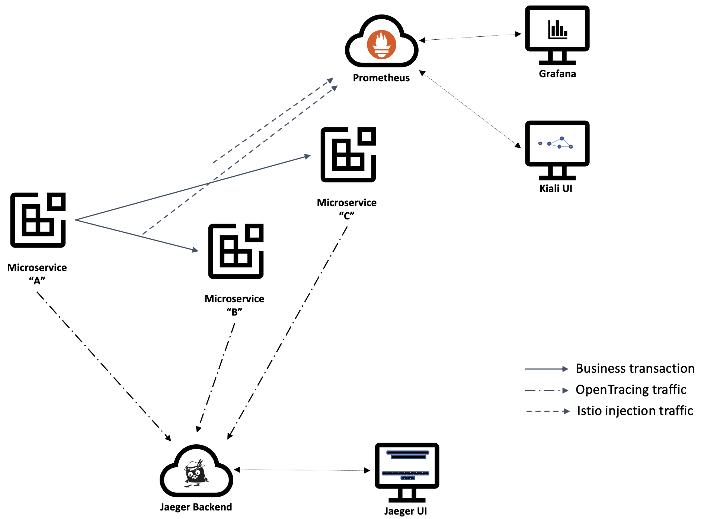
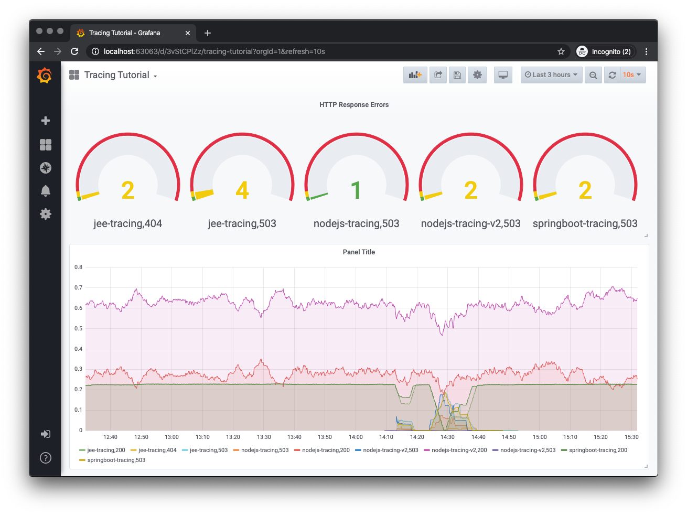
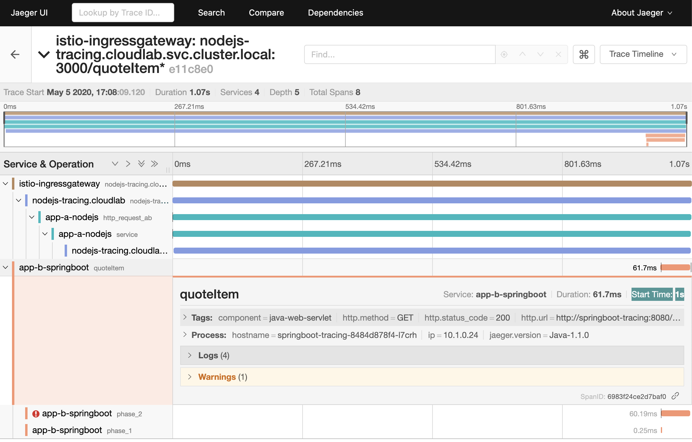
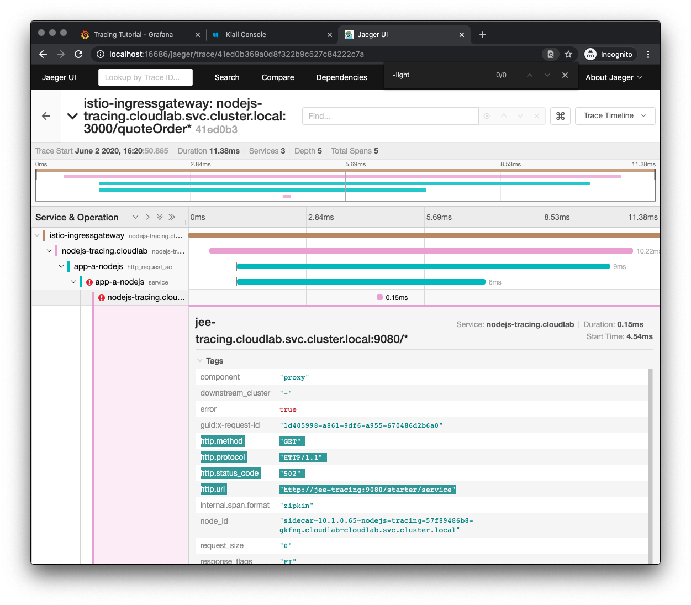

This is the second part of a two-part tutorial, where you will deploy the microservices created in part 1 behind a service mesh in a Kubernetes cluster and then use popular traffic analysis tools to observe and inspect the internal state of the distributed service

This tutorial is meant for developers who are somewhat familiar with the concept of distributed tracing using [OpenTracing](https://opentracing.io/) APIs as well as the [Istio service mesh](https://istio.io)

As mentioned in part 1, Appsody is one of the upstream open source projects included in [IBM Cloud Pak for Applications] (https://www.ibm.com/cloud/cloud-pak-for-applications) and is used through this series to expedite the creation and deployment of the microservices.

At the end of the tutorial, you will have instrumented the existing microservices to work inside a Kubernetes cluster augmented with an Istio service mesh, generated some traffic through that microservices architecture, and used tools like Grafana, Kiali and Jaeger to progressively drill into the state of the overall system:



This [GitHub repository](https://github.com/IBM/icpa-opentracing) contains a copy of the final application after completion of all steps, which you can use as a reference throughout the 
tutorial.


## A word about service meshes

The full potential of microservices relies on flexibility and resilience in the communications so that new services or new versions of existing services can be introduced and removed without negative impacts on the overall system.

Service meshes such as [Istio](https://istio.io) are commonly paired with microservices to intermediate traffic amongst them, injecting functionality such as load balancing, security, and automatic generation of traffic metrics.

If you are new to service meshes and want to learn more about them before proceeding, [this overview](https://www.redhat.com/en/topics/microservices/what-is-a-service-mesh) is a good starting point, whereas the [Istio Concepts](https://istio.io/docs/concepts/what-is-istio/) page expands those concepts into a more detailed view of Istio capabilities. If you want to dive even deeper into service meshes after you complete this tutorial, you can try these guided [Service Mesh labs](https://learn.openshift.com/servicemesh/), with hands-on exercises ranging from basic to advanced lessons.


## Prerequisites

* [Install Docker](https://docs.docker.com/get-started/).
  If using Windows or macOS, Docker Desktop is probably the best choice. If using a Linux system, [minikube](https://github.com/kubernetes/minikube) and its internal Docker registry is an alternative.

* [Install the Appsody CLI](https://appsody.dev/docs/getting-started/installation).

* Install Kubernetes locally if you do not have access to a Kubernetes or OpenShift cluster. [minikube](https://github.com/kubernetes/minikube) will work on most platforms, but if using Docker Desktop, the internal Kubernetes enabled from the Docker Desktop Preferences (macOS) or Settings (Windows) panel is a more convenient alternative. 


## Estimated time

With the prerequisites in place, you should be able to complete this second part of the tutorial in 1 hour.


## Steps

Following along to this tutorial, you will perform the following steps:

1. Set up the development environment
1. Deploy the service mesh
1. Create the namespace for the microservices
1. Create the images for the microservices
1. Create application configuration
1. Configure sidecar injection
1. Labeling the workload
1. Deploy the microservices
1. Create ingress routes for the application
1. Inspect telemetry
1. Teardown the deployment

These steps can be split into two major groups, first building and instrumenting the basic microservice applications, then progressing into a more complex deployment into an Istio service mesh.

Using a service mesh reflects a more common deployment topology for production environments, especially when using Appsody in combination with the other components of project Kabanero (the upstream open source project for IBM Cloud Pak for Applications).


### 1 Set up the local development environment

If you completed the first part of the series, simply export the `tutorial_dir` environment variable:

```sh
export tutorial_dir=<same location where you started the first part of the series>
```

If you skipped the first part of the series, clone this GitHub repository and export the `tutorial_dir` environment variable, entering the following command
```sh
git clone https://github.com/IBM/icpa-opentracing.git
cd icpa-opentracing
export tutorial_dir=$(PWD)
```


### 2 Deploy the service mesh

This tutorial uses Istio as the service mesh for the microservices architecture completed in the previous steps.

Thanks to the "side-car" architecture pattern, also used in Istio, a new traffic intermediation container is added to each pod running a service, which means microservices do not require alterations to benefit from the service mesh functionality.

The next steps assume the usage of the Istio "Demo" profile added on top of minikube or the Kubernetes cluster bundled with Docker Desktop. It is possible to use other providers, but the installation of everything present in the Istio "Demo" profile may be quite involved and are outside the scope of this tutorial.

Assuming you will follow the recommendation of using minikube or the Kubernetes cluster bundled with Docker Desktop, proceed with the [Istio installation instructions](https://istio.io/docs/setup/getting-started/), which are summarized below:

IMPORTANT: [This Appsody issue](https://github.com/appsody/appsody-operator/issues/227) is currently blocking the usage of Istio 1.5 and above, so do not update the `ISTIO_VERSION` in the command below until that issue is fixed:

```
curl -L https://istio.io/downloadIstio | ISTIO_VERSION=1.5.0 sh -
cd istio-1.5*
export PATH="$PATH:$(PWD)/bin"

istioctl verify-install

istioctl manifest apply \
  --set profile=demo \
  --set values.tracing.enabled=true \
  --set values.grafana.enabled=true \
  --set values.kiali.enabled=true
```

The output shoud look similar to the one below:

```
Detected that your cluster does not support third party JWT authentication. Falling back to less secure first party JWT. See https://istio.io/docs/ops/best-practices/security/#configure-third-party-service-account-tokens for details.
- Applying manifest for component Base...
✔ Finished applying manifest for component Base.
- Applying manifest for component Pilot...
✔ Finished applying manifest for component Pilot.
- Applying manifest for component EgressGateways...
- Applying manifest for component IngressGateways...
- Applying manifest for component AddonComponents...
✔ Finished applying manifest for component EgressGateways.
✔ Finished applying manifest for component IngressGateways.
✔ Finished applying manifest for component AddonComponents.

✔ Installation complete
```


### 3 Create the namespace for the microservices

The tutorial will create several resources in the target cluster and it is beneficial to keep that content separate from other resources you may already have in the container.

You will create a new namespace for this tutorial, named `tracing`, typing the following commands in a command-line terminal:

```sh
kubectl get namespace cloudlab || \
kubectl create namespace cloudlab
```


### 4 Create the Docker images for the microservices

As a first step before deployment of the microservices, you will request the build of the Docker images for each of the microservices. For this step, you can reuse the command-line terminals from the first part of this tutorial or create new ones. 

Assuming the environment variable `tutorial_dir` was set to the directory where you first started the tutorial and created the `jaeger.properties` file, type the following commands from the command-line terminal:

```sh
cd "${tutorial_dir}"
cd nodejs-tracing
appsody build
```

```sh
cd "${tutorial_dir}"
cd springboot-tracing
appsody build
```

```sh
cd "${tutorial_dir}"
cd jee-tracing
appsody build
```

Once all image builds are complete, inspect the output of the following command:

```sh
docker images dev.local/*
```

This command should result in an output similar to this:

```
REPOSITORY                     TAG                 IMAGE ID            CREATED             SIZE
dev.local/nodejs-tracing       latest              597adcbeb47e        3 minutes ago       192MB
dev.local/springboot-tracing   latest              c2ccb43475e1        4 minutes ago       412MB
dev.local/jee-tracing          latest              138f3c5276d6        4 minutes ago       708MB
```

Additionally, you will also find a new `app-deploy.yaml` file at the root of each respective project.
This deployment file contains an `AppsodyApplication` definition, which is documented in detail in the [Appsody Operator GitHub page](https://github.com/appsody/appsody-operator/tree/master/doc).

This tutorial will have small and instructions for modifications to the file, but you can refer to the [Appsody Operator User Guide](https://github.com/appsody/appsody-operator/blob/master/doc/user-guide.md) if you plan on further customizing the deployment of the microservices.


### 5 Create application configuration

[Create a ConfigMap](https://kubernetes.io/docs/tasks/configure-pod-container/configure-pod-configmap/#create-a-configmap) with the Jaeger configuration settings similar to the ones set in the `jaeger.properties` in the first part of this tutorial:

```sh
cat <<EOF | kubectl apply -n cloudlab -f -
apiVersion: v1
kind: ConfigMap
metadata:
  name: jaeger-config
data:
  JAEGER_ENDPOINT: http://jaeger-collector.istio-system.svc.cluster.local:14268/api/traces
  JAEGER_PROPAGATION: b3
  JAEGER_REPORTER_LOG_SPANS: "true"
  JAEGER_SAMPLER_PARAM: "1"
  JAEGER_SAMPLER_TYPE: const
EOF

kubectl get configmap jaeger-config -n cloudlab -o yaml
```

Add the new `ConfigMap` to the application, inserting the `envFrom` snippet to the `spec` section of the `app-deploy.yaml` file for each application, as exemplified below:

```yaml
spec:
...
  envFrom:
  - configMapRef:
      name: jaeger-config
  ...
```


### 6 Configure sidecar injection

An Istio sidecar is a proxy added by Istio throughout the environment, to intercept the communication between microservices before exercising its traffic management functions. You can read more about all the available possibilities in the [Istio sidecar configuration](https://istio.io/docs/reference/config/networking/sidecar/) page, but for this tutorial, you are interested in the proxy's ability to add tracing instrumentation to the applications in the pod.

There are two ways of injecting the Istio sidecar to an application:

1. Using the `istio kube-inject` command
2. Enabling automatic injection of sidecars to all applications added to a namespace

The second alternative is more approachable for this tutorial since it requires fewer instructions to be typed on the terminal. 

Enabling automatic injection is described in the [Installing the Sidecar](https://istio.io/docs/setup/additional-setup/sidecar-injection/) section of the Istio documentation. The essential takeaway from that documentation is that you need to add the label `istio-injection=enabled` annotation to the namespace where you want automatic injection Istio sidecars, so type the following instructions in the command-line:

```sh
kubectl label namespace cloudlab istio-injection=enabled
```

You can verify the results entering the following command:

```sh
kubectl get namespace -L istio-injection
```

Add the `sidecar.istio.io/inject` annotation to the `metadata.annotations` section of the `app-deploy.yaml` file for each application. 

```yaml
metadata:
  annotations:
    ...
    sidecar.istio.io/inject: "true"
    ...
  ...
...
```

Notice how you could set the `sidecar.istio.io/inject` annotation to `"false"` to turn off the injection for an individual application even when automatic injection is enabled for the target namespace.

Optionally, replace the `service.type` value with `ClusterIP` in `app-deploy.yaml`. This change will remove the external port for the microservice, which ensures no one accidentally bypasses the Istio traffic management.


### 7 Labeling the workload

Istio has a few labels that must be set in the deployment to instruct the service mesh about the name and version of the application.

These labels are defined in the [Pods and Services](https://istio.io/docs/ops/deployment/requirements/) page of the Istio documentation. Add the following labels to the `app-deploy.yaml` file for the `nodejs-tracing` application:

```yaml
metadata:
  ...
  labels:
     app: nodejs-tracing
     version: v1
     ...
...
```

The last required label is the [protocol selection](https://istio.io/docs/ops/configuration/traffic-management/protocol-selection/) field, classifying the traffic type as HTTP traffic:

```yaml
spec:
  service:
    ...
    portName: http

```


### 8 Deploy the microservices

As a summary up to this point, you have made the following changes to your cluster and the deployment descriptor of each application:

- Created a namespace (`cloudlab`) for deploying the applications

- Enabled that namespace for automatic injection of Istio sidecars

- Created a `ConfigMap` resource containing the Jaeger endpoint information

- Added an `envFrom` entry to reference the `ConfigMap` resource in the `app-deploy.yaml` deployment descriptor for each application 

- Added a `sidecar.istio.io/inject` annotation to the `service` in the `app-deploy.yaml` deployment descriptor for each application

- Added the `app` and `version` labels to the `metadata` section and `portName` field to the `service` section of the `app-deploy.yaml` deployment descriptor for each application

With those changes in place, and assuming the environment variable `tutorial_dir` is set to the directory where you first started the tutorial, type the following commands from the command-line terminal:

```sh
cd "${tutorial_dir}"
cd nodejs-tracing
appsody deploy --namespace cloudlab
```

```sh
cd "${tutorial_dir}"
cd springboot-tracing
appsody deploy --namespace cloudlab
```

```sh
cd "${tutorial_dir}"
cd jee-tracing
appsody deploy --namespace cloudlab
```

In concrete terms for the actual deployment, the "sidecar injection" means Istio adds a proxy container to each pod running the microservices. This is a good point in the tutorial to take a look at the running containers before the injection. Type the following instruction in the command-line terminal:

```sh
kubectl get pods -n cloudlab -l app.kubernetes.io/managed-by=appsody-operator
```

You should see output similar to the one below, with two containers inside each pod, which indicates the sidecar has been added:

```
NAME                                  READY   STATUS    ...
jee-tracing-6cd5784b57-hm65c          2/2     Running   ...
nodejs-tracing-5cf9f655db-kl4gl       2/2     Running   ...
springboot-tracing-5f7b7fb74f-hzxl5   2/2     Running   ...
```


#### Note about sidecar injection at the application level

The previous sections enabled sidecar injection for all deployments in a namespace. There may be good reasons to avoid introducing that default behavior and apply the instrumentation to individual applications. Just in the way of a reference, this is how you would instrument an Appsody-based application with an Istio sidecar after it has been deployed:

```sh
application_name=<<name of your Appsody application, such as "nodejs-tracing" >>
kubectl get deployment ${application_name}  -o yaml | istioctl kube-inject -f - | kubectl apply -f -
```

Note that `kube-inject` command modifies the deployment descriptor directly in the cluster, leaving the original `app-deploy.yaml` file unmodified. Future invocations of `appsody deploy` will overwrite those modifications.


#### (Optional) Tail microservices logs

You can type the following commands in three separate terminal windows to follow the console output of each application as you progress towards the rest of the tutorial:

```sh
kubectl logs -n cloudlab -f -l app.kubernetes.io/name=nodejs-tracing --all-containers | grep -vi "live\|ready\|inbound\|metrics"
```

```sh
kubectl logs -n cloudlab -f -l app.kubernetes.io/name=springboot-tracing --all-containers | grep -vi "live\|ready\|inbound"
```

```sh
kubectl logs -n cloudlab -f -l app.kubernetes.io/name=jee-tracing --all-containers | grep -vi "live\|ready\|inbound"
```


### 9 Create ingress routes for the application

As the final step before sending transactions into the Node.js microservice, you need to configure Istio Gateway and VirtualService resources to route traffic to the application:


```sh
cat <<EOF | kubectl apply -n cloudlab -f -
apiVersion: networking.istio.io/v1alpha3
kind: Gateway
metadata:
  name: tutorial-gateway
spec:
  selector:
    istio: ingressgateway # use istio default controller
  servers:
  - port:
      number: 80
      name: http
      protocol: HTTP
    hosts:
    - "*"
---
apiVersion: networking.istio.io/v1alpha3
kind: VirtualService
metadata:
  name: tutorial-service
spec:
  hosts:
  - "*"
  gateways:
  - tutorial-gateway
  http:
  - match:
    - uri:
        prefix: "/quoteOrder"
    rewrite:
      uri: "/node-jee"
    route:
    - destination:
        host: nodejs-tracing
  - match:
    - uri:
        prefix: "/quoteItem"
    rewrite:
      uri: "/node-springboot"
    route:
    - destination:
        host: nodejs-tracing
EOF
```

Note the remapping of the `/node-springboot` and `/node-jee` virtual endpoints to `/quoteItem` and `/quoteOrder`, respectivelly, in the `VirtualService`, illustrating how one can recombine microservices endpoints independently of how they were named in the original application.

Now issue the following commands a few times:

```sh
curl localhost/node-springboot
curl localhost/node-jee
```

You can also leave the commands running continuously with:

```sh
while true; do
  curl -s localhost/quoteItem; sleep 2
  curl -s localhost/quoteOrder; sleep 2
done
```


### 10 Inspect telemetry

You can verify the results of the trace data collected from the applications while servicing requests with any of the telemetry add-ons bundled with Istio.


#### Grafana - Istio dashboards

[Grafana](https://grafana.com/) is one of the most prominent analytics and monitoring tools in the market and is bundled with Istio deployments. A Grafana dashboard is often the first line of observation for the data generated by an application and that is where you can see some of the data generated in this tutorial.

First, launch the Grafana dashboard, typing the following instruction from the command-line:

```sh
istioctl dashboard grafana &
```

Once the new tab for the Grafana UI shows up in your default browser, select the "Explore" button on the left navigation bar, you can inspect some of the Istio pre-packaged dashboards by clicking on the "Dashboards" menu in the left menu, then select "Manage".

In the resulting "Manage" tab, click on the "istio" folder, then select "Istio Service Dashboard". Once the dashboard completes rendering, select "nodejs-tracing.cloudlab.svc.cluster.local" in the "Service" field and hit Enter. Depending on the traffic still being generated from previous sections, you should see a screen similar to the one below:


#### Grafana - Explore metrics

As an exercise to give you some idea of how you would reference Istio service mesh metrics to build your dashboard, click on the "Explore" menu and then type the following [PromQL query](https://prometheus.io/docs/prometheus/latest/querying/basics/) in the field marked `<Enter a PromQL query>`:


```
avg by (destination_service_name, destination_version, response_code)(rate(istio_requests_total{destination_service_namespace="cloudlab"}[5m]))
```

This tutorial is not a primer on PromQL, but the breakdown of the query can be read as follows: _"average the rate of requests in the Istio mesh for each service grouped in 5-minute intervals and then group them by service name, service version, and HTTP response code"_.

The resulting visualization in the picture below is a simple and effective way of observing the volume of requests split between successful and unsuccessful responses.


If you do not see some of the response errors in the chart, which is expected since the sequence of steps in the tutorial waited until all microservices were up and running, you can simulate a system crash where all pods get restarted simultaneously.

Assuming you left that `while` loop running in the background, sending requests to the Node.js application, simulate a system crash by using the Istio [Fault Injection](https://istio.io/docs/tasks/traffic-management/fault-injection/) support.

Inject the failure by creating an Istio `VirtualService` for the `jee-tracing` microservice:

```sh
cat <<EOF | kubectl apply -n cloudlab -f -
apiVersion: networking.istio.io/v1alpha3
kind: VirtualService
metadata:
  name: jee-tracing
spec:
  hosts:
  - jee-tracing
  http:
  - fault:
      abort:
        httpStatus: 502
        percentage:
          value: 70
    route:
    - destination:
        host: jee-tracing
  - route:
    - destination:
        host: jee-tracing
EOF
```

The change takes place immediately, generating HTTP `502` gateway errors in 70% of the calls incoming from the Node.js application.

Hit the refresh button in the upper right corner of the Grafana UI and you should see some of the new errors in the graph.


#### (optional) Grafana - Import dashboard

As a final exercise for the Grafana dashboard, you can import and study the dashboard contained in the GitHub repository for this tutorial, located at https://github.com/IBM/icpa-opentracing/blob/master/grafana/GrafanaTutorialDashboard.json).

Select "Dashboards" from the left menu again and click on the "Manage" button, then click on the "Import" button. In the "Import" panel, paste the contents of the file in the form and hit the "Load" button, which should display a dashboard similar to this:




#### Kiali

The [Kiali UI](https://docs.openshift.com/container-platform/latest/service_mesh/service_mesh_arch/ossm-kiali.html) provides visibility into your service mesh by showing you the microservices in your service mesh, and how they are connected.

You could expose the Kiali UI to a fixed port in your localhost using the instructions in https://istio.io/docs/tasks/observability/gateways/#option-2-insecure-access-http, but it is more convenient to use the `istioctl dashboard` command. 

Type the following instruction on a command-line interface:

```sh
istioctl dashboard kiali
```

The dashboard will open as a tab in your default web browser. The default user and password is `admin:admin`

Once you are in the Kiali UI, explore the visualizations in the left navigation panel. The focus in this tutorial is on the "Graph" view, where you can see the topology of the microservices created in this tutorial.

Open that "Graph" view and select "tracing" in the "Namespace" field, which matches the Kubernetes namespace used in the tutorial. You should see a view similar to this:


Note that the visualization is still missing some of the HTTP-specific numbers on the right panel due to Appsody issue [Need support for named ports for service meshes](https://github.com/appsody/appsody-operator/issues/227), but you can see the potential of the service mesh in helping you understand the application topology as well as the volume and reliability of the traffic distribution across various services.


#### Jaeger UI

The Jaeger UI has already been covered in the first part of this tutorial, so the focus of this section is narrowed to visualizing the additional spans introduced by Istio into the overall distributed transaction.

Launch the Jaeger UI with the following command:

```sh
istioctl dashboard jaeger
```

Select "istio-mixer" in the "Service" menu and hit the "Find Traces" button, then click on one of the traces, which should display a screen similar to the one below:


In this trace you can see the points where Istio injected its traffic management into the business transactions, mediating inbound and inter-component traffic along the way.

As a last modification to the system, we can further exploit Istio's fault injection support to introduce a delay on the responses from a microservice, which is useful to explore the overall system tolerance to slow responses in given component.

Inject the delays by creating an Istio `VirtualService` for the `springboot-tracing` microservice:

```sh
cat <<EOF | kubectl apply -n cloudlab -f -
apiVersion: networking.istio.io/v1alpha3
kind: VirtualService
metadata:
  name: springboot-virtual-service
spec:
  hosts:
  - springboot-tracing
  http:
  - fault:
      delay:
        fixedDelay: 1s
        percentage:
          value: 50
    route:
    - destination:
        host: springboot-tracing
  - route:
    - destination:
        host: springboot-tracing
EOF
```

Search for the traces associated with the operation named "quoteItem" and notice how 50% of them are taking over one second. Expand one of the traces and note the delay in the call from the service "A" to service "B" (implemented by the Spring Boot application):



Another type of fault injection is the simulation of failures in the communication, which is also useful when trying to understand the system behavior during partial outages.

Inject the failures in the `jee-tracing` microservice by creating this other  Istio `VirtualService` object in the namespace:

```sh
cat <<EOF | kubectl apply -n cloudlab -f -
apiVersion: networking.istio.io/v1alpha3
kind: VirtualService
metadata:
  name: jee-virtual-service
spec:
  hosts:
  - jee-tracing
  http:
  - fault:
      abort:
        httpStatus: 502
        percentage:
          value: 80
    route:
    - destination:
        host: jee-tracing
  - route:
    - destination:
        host: jee-tracing
EOF
```

Search for the traces associated with the operation named "quoteOrder" and notice how 80% of them are now labeled with the "Error" tag. Expand one of the traces and note the presence of HTTP status code "502" in the result from calls to the "jee-tracing" application endpoint:



These examples conclude the overview of the usage of the Jaeger console in understanding and troubleshooting the communication amongst services.


### 11 Tear down the deployment

Delete everything created in this tutorial by typing the following instruction from the directory containing each application:

```sh
kubectl delete namespace cloudlab
```

If you deployed Istio as part of this tutorial, you can remove it from your cluster by typing the following instructions on a command-line terminal:

```sh
kubectl delete namespace istio-system
```


## Next steps

- Explore other [Istio Telemetry Addons](https://istio.io/docs/tasks/observability/gateways/)

- Try other [traffic management](https://istio.io/docs/tasks/traffic-management/) capabilities in Istio, such as fault injection, traffic shifting, and circuit breaking.

- Try these hands-on [service mesh labs](https://learn.openshift.com/servicemesh/), which contains a good list of basic and advanced lessons.


## API references 

- [Spans](https://opentracing.io/docs/overview/spans/)

- [The OpenTracing Semantic Specification](https://github.com/opentracing/specification/blob/master/specification.md)

- [NodeJS OpenTracing API doc](https://opentracing-javascript.surge.sh/)

- [OpenTracing API Javadoc](https://javadoc.io/doc/io.opentracing/opentracing-api/latest/index.html)

- [MicroProfile OpenTracing](https://github.com/eclipse/microprofile-opentracing)

- [Java Spring Jaeger](https://github.com/opentracing-contrib/java-spring-jaeger)


## Credits

- Thanks to my colleague Carlos Santana, who wrote the excellent ["Learning Distributed Tracing 101" tutorial](https://ibm-cloud-architecture.github.io/learning-distributed-tracing-101/docs/index.html), which was instrumental in helping me figure out the Node.js aspects of this tutorial.

- Thanks to Yuri Shkuro (the father of Jaeger) and Junmin Liu for the excellent [Node.js chapter of the OpenTracing tutorial](https://github.com/yurishkuro/opentracing-tutorial/tree/master/nodejs).
