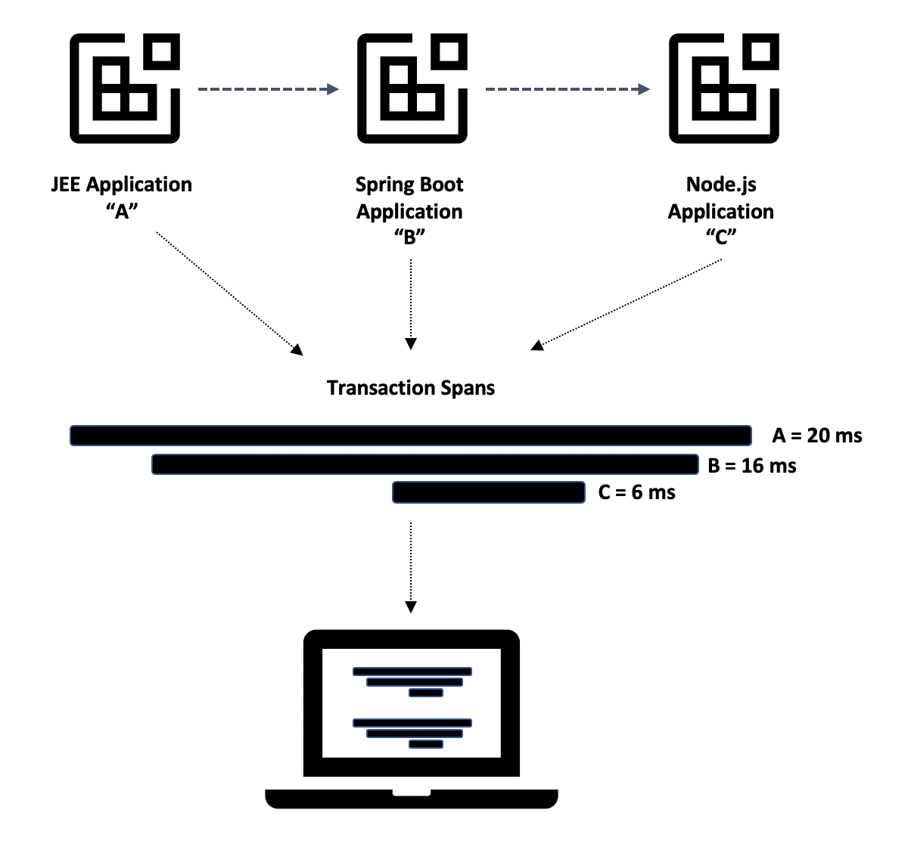
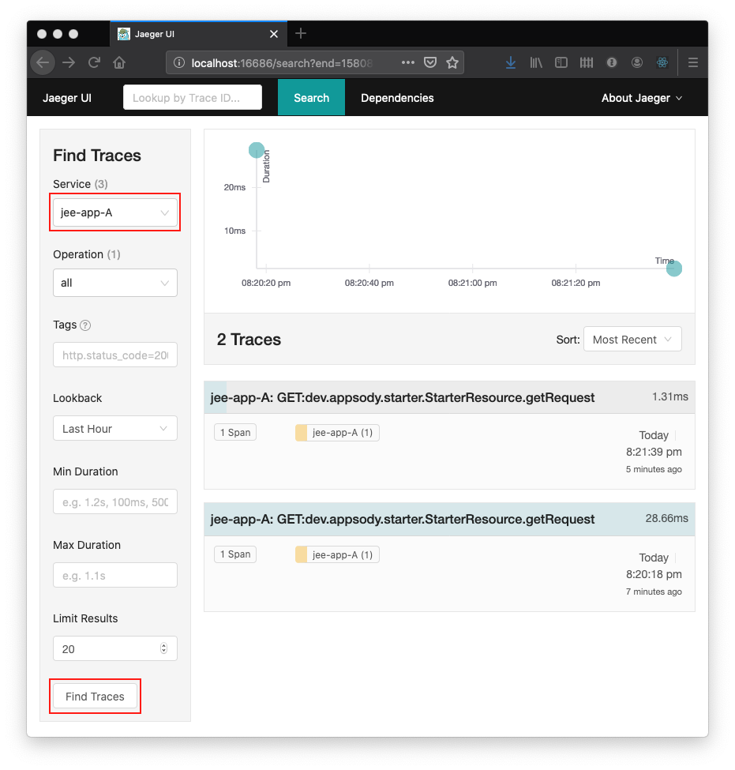

In this tutorial, ...

https://opentracing.io/

https://opentelemetry.io/


## Prerequisites

[[[ Whole section is copy-paste placeholder ]]]


* [Install Docker](https://docs.docker.com/get-started/).
  If using Windows or macOS, Docker Desktop is probably the best choice. If using a Linux system, [minikube](https://github.com/kubernetes/minikube) and its internal Docker registry is an alternative.

* [Install the Appsody CLI](https://appsody.dev/docs/getting-started/installation).

* Install Kubernetes. [minikube](https://github.com/kubernetes/minikube) will work on most platforms, but if using Docker Desktop, the internal Kubernetes enabled from the Docker Desktop Preferences (macOS) or Settings (Windows) panel is a more convenient alternative.


## Estimated time

With the prerequisites in place, you should be able to complete this tutorial in 1 hour.


## Steps

Following along to this tutorial, you will perform the following steps:

1. Setup local development 
1. Create the JEE application
1. Create the Spring boot application
1. Create the Node.js application
1. Examining tracing results (local)
1. Examining tracing results (OpenShift playground)
1. Tear down

At the end of the tutorial, you will have progressed from ...




## Step 1. Setup local development 

You will need a local [all-in-one Jaeger server](https://www.jaegertracing.io/docs/1.6/getting-started/) running throughout the as you progress through the steps in this tutorial. 

This all-in-one server acts both as the backend for receiving the telemetry data from the various servers participating in a distributed transaction, as well as the host for the Jaeger console from where you can inspect the results of each transaction.

### Create a custom Docker network

This tutorial has many applications that need to locate each other via name lookups, which is easier when using a custom Docker network instead of the default bridge network.

Execute the following command from a command-line terminal:

```sh
docker network create opentrace_network
```

### Start a local Jaeger server

The instructions in the tutorial expect the all-in-one server to be named "jaeger", which needs to be specified as a parameter when creating the container.

Type the following starting command from a command-line terminal, observing the presence of the `network` parameter cross-referencing the Docker network you just created:

```sh
docker run --name jaeger \
  -e COLLECTOR_ZIPKIN_HTTP_PORT=9411 \
  -p 5775:5775/udp \
  -p 6831:6831/udp \
  -p 6832:6832/udp \
  -p 5778:5778 \
  -p 16686:16686 \
  -p 14268:14268 \
  -p 9411:9411 \
  --network opentrace_network \
  jaegertracing/all-in-one:1.6
```


## Step 2. Create the JEE application

As mentioned in the steps section, you will create a JEE application and instrument it with tracing capabilities.

Using the Appsody command-line interface makes the creation step quite simple, requiring a single command to create a working skeleton of a JEE application using the Open Liberty server:

```sh
mkdir jee-tracing
cd jee-tracing
appsody init incubator/java-openliberty
```

Before starting making modifications to the application, take a moment to inspect the template application created by Appsody:

```
java-openliberty
├── pom.xml
└── src
    ├── main
    │   ├── java
    │   │   └── dev
    │   │       └── appsody
    │   │           └── starter
    │   │               ├── StarterApplication.java
    │   │               ├── StarterResource.java
    │   │               └── health
    │   │                   ├── StarterLivenessCheck.java
    │   │                   └── StarterReadinessCheck.java
    │   ├── liberty
    │   │   └── config
    │   │       └── server.xml
    │   └── webapp
    │       ├── WEB-INF
    │       │   └── beans.xml
    │       └── index.html
    └── test
        └── java
            └── it
                └── dev
                    └── appsody
                        └── starter
                            └── HealthEndpointTest.java
```


### Assign a name to the application

Since you want to easily identify this application while inspecting a tracing span, the first modification to the application is to change the application name inside the newly generated `pom.xml` file.

Modify the line containing `<artifactId>starter-app</artifactId>` in `pom.xml` to this line instead:

```xml
    <artifactId>app-A-jee</artifactId>
```

### Enable OpenTracing using Jaeger client

The next modification is to enable OpenTracing within the Open Liberty runtime, which requires a couple of localized changes to both the `pom.xml` and `src/main/liberty/config/server.xml` files.

The nature of these changes is explained in a bit more in the [Open Liberty blog entry announcing the support of Jaeger as a tracing backend](https://openliberty.io/blog/2019/12/06/microprofile-32-health-metrics-190012.html#jmo).

The first change is to include the [Jaeger Java client library](https://github.com/jaegertracing/jaeger-client-java) dependency in the final application. If you look at the Open Liberty documentation it will instruct you to create a new shared library available to all applications running inside the container, but that level of complexity is unnecessary in a microservice where there will be a single application inside that server.

Insert the [Maven jaeger-client dependency](https://mvnrepository.com/artifact/io.jaegertracing/jaeger-client) XML element inside the `<dependencies>` element of the `pom.xml` file:

```xml
        <dependency>
            <groupId>io.jaegertracing</groupId>
            <artifactId>jaeger-client</artifactId>
            <version>0.34.0</version>
        </dependency>
```

Note that this version of the Jaeger client, while not the latest, it is the version tested with the version of Open Liberty bundled in the Appsody `java-openliberty` stack at the time this tutorial was written. See notes in section [xxxx] about common problems while attempting to use different versions.

The next step is to add the OpenTracing feature to the Open Liberty server. Add the following element inside the `featureManager` section of the `src/main/liberty/config/server.xml` file:

```xml
        <feature>mpOpenTracing-1.3</feature>
```

Replace the `webApplication` element in the `src/main/liberty/config/server.xml` file with this snippet:

```xml
    <webApplication location="app-A-jee.war" contextRoot="/" >
        <classloader apiTypeVisibility="+third-party" />
    </webApplication>
```


### Launch the application

With the modification in place, it is time to launch the application and validate that it is instrumented for tracing distributed transactions.

Type the following command on a separate command-line window:


```sh
appsody run \
   -p 9444:9443 \
   -p 9081:9080 \
   --docker-options="--env JAEGER_AGENT_HOST=jaeger --env JAEGER_REPORTER_LOG_SPANS=true --env JAEGER_SAMPLER_TYPE=const --env JAEGER_SAMPLER_PARAM=1" \
    --network opentrace_network 
```

Note the `JAEGER_AGENT_HOST` parameter matching the name of the Jaeger all-in-one server launched in previous steps, as well as the usage of the `network` parameter to place the container in the same custom Docker network created at the beginning of the tutorial. You can inspect the other Jaeger configuration parameters at https://github.com/jaegertracing/jaeger-client-java/blob/master/jaeger-core/README.md


You should see a message such as the one below indicating that the server is ready to accept requests:

`[Container] [INFO] [AUDIT   ] CWWKF0011I: The defaultServer server is ready to run a smarter planet.`

Once you see the message, you should issue a few requests to the sample resource created along with the application.

```
curl -k https://localhost:9444/starter/resource
```

You can then launch the Jaeger UI in your browser of choice, by opening this URL:
http://localhost:16686

Choose the `jee-app-A` application in the Service menu and then click on the "Search" button, which should display the transactions you initiated from the command-line:




## Step 3. Create the Spring Boot application

It is now time to create the Spring Boot application, once again using the Appsody command-line interface. Type the following command in the command-line interface:

```sh
mkdir springboot-tracing
cd springboot-tracing
appsody init incubator/java-spring-boot2
```

Before starting making modifications to the application, take a moment to inspect the template application created by Appsody:

```
springboot-tracing
├── mvnw
├── mvnw.cmd
├── pom.xml
└── src
    ├── main
    │   ├── java
    │   │   └── application
    │   │       ├── LivenessEndpoint.java
    │   │       └── Main.java
    │   └── resources
    │       ├── application.properties
    │       └── public
    │           └── index.html
    └── test
        └── java
            └── application
                └── MainTests.java
```


### Assign a name to the application

Since you want to easily identify this application while inspecting a tracing span, the first modification to the application is to change the application name inside the newly generated `pom.xml` file.

Modify the line containing `<artifactId>default-application</artifactId>` in `pom.xml` to this line instead:

```xml
    <artifactId>springboot-app-B</artifactId>
```

### Enable OpenTracing using Jaeger client

For this section, you will follow the instructions outlined in the [https://github.com/opentracing-contrib/java-spring-jaeger
The next modification is to enable OpenTracing within the Spring Boot runtime, which requires a couple of localized changes to the`pom.xml` file

For ththe support of Jaeger as a tracing backend](https://github.com/opentracing-contrib/java-spring-jaeger).

The first change is to include the [Jaeger Java client library](https://github.com/jaegertracing/jaeger-client-java) dependency in the final application. If you look at the Open Liberty documentation it will instruct you to create a new shared library available to all applications running inside the container, but that level of complexity is unnecessary in a microservice where there will be a single application inside that server.

Insert the [Maven opentracing-spring-jaeger-cloud-starter dependency](https://mvnrepository.com/artifact/io.opentracing.contrib/opentracing-spring-jaeger-cloud-starter) inside the `<dependencies>` element of the `pom.xml` file:

```xml
    <dependency>
        <groupId>io.opentracing.contrib</groupId>
        <artifactId>opentracing-spring-jaeger-cloud-starter</artifactId>
        <version>0.2.0</version>
    </dependency>
```


### Launch the application

With the modification in place, it is time to launch the application and validate that it is instrumented for tracing distributed transactions.

Type the following command on a separate command-line window:

```sh
appsody run \
   --docker-options="--env JAEGER_AGENT_HOST=jaeger --env JAEGER_REPORTER_LOG_SPANS=true --env JAEGER_SAMPLER_TYPE=const --env JAEGER_SAMPLER_PARAM=1" \
    --network opentrace_network 
```

Note the `JAEGER_AGENT_HOST` parameter matching the name of the Jaeger all-in-one server launched in previous steps, as well as the usage of the `network` parameter to place the container in the same custom Docker network created at the beginning of the tutorial.

You should see a message such as the one below indicating that the server is ready to accept requests:

`[Container] [INFO] [AUDIT   ] CWWKF0011I: The defaultServer server is ready to run a smarter planet.`

Once you see the message, you should issue a few requests to the sample resource created along with the application.

```
curl -k https://localhost:9444/starter/resource
```

You can then launch the Jaeger UI in your browser of choice, by opening this URL:
http://localhost:16686

Choose the `app-B-springboot` application in the Service menu and then click on the "Search" button, which should display the transactions you initiated from the command-line:


## Create the Node.js application


It is now time to create the Node.js application, once again using the Appsody command-line interface. Appsody supports both [Express](https://expressjs.com/) and [LoopBack](https://loopback.io/) frameworks and for this tutorial you will use the Express framework.

Type the following command in the command-line interface:

```sh
mkdir nodejs-tracing
cd nodejs-tracing
appsody init incubator/nodejs-express
```

Take a moment to inspect the structure of the template application created by Appsody:

```
nodejs-tracing
├── app.js
├── package-lock.json
├── package.json
└── test
    └── test.js

```


### Assign a name to the application

Since you want to easily identify this application while inspecting a tracing span, the first modification to the application is to change the application name inside the newly generated `package.json` file.

Modify the line containing `"name": "nodejs-express-simple",` in `package.json` to this line instead:

```json
    "name": "app-c-nodejs",
```

### Enable OpenTracing using Jaeger client

For this section, you will follow the instructions outlined in the [Jaeger documentation](https://github.com/jaegertracing/jaeger-client-node).

Following the code sample in the instructions in that page, the first change is to include the `jaeger-client` package in your application.

First include the [package dependency](https://www.npmjs.com/package/jaeger-client) in the `package.json` file, 

```json
  "dependencies": {
    "jaeger-client": "^3.17.1"
  },
```

Then insert this entire block of code to the top of the `app.js` file:

```js
var initTracerFromEnv = require('jaeger-client').initTracerFromEnv;
var config = {
  serviceName: 'app-C-nodejs',
};
var options = {
  tags: {
    'my-awesome-service.version': '1.1.2',
  }
};
var tracer = initTracerFromEnv(config, options);
```


### Launch the application

With all modifications in places, it is time for you to launch the application and validate that it is instrumented for tracing distributed transactions.

Type the following command on a separate command-line window:

```sh
appsody run \
   --docker-options="--env JAEGER_AGENT_HOST=jaeger --env JAEGER_AGENT_PORT=6832 --env JAEGER_REPORTER_LOG_SPANS=true --env JAEGER_SAMPLER_TYPE=const --env JAEGER_SAMPLER_PARAM=1" \
    --network opentrace_network 
```

Once again, notice the `JAEGER_AGENT_HOST` parameter matching the name of the Jaeger all-in-one server launched in previous steps, as well as the usage of the `network` parameter to place the container in the same custom Docker network created at the beginning of the tutorial.

You should see a message such as the one below indicating that the server is ready to accept requests:

`[Container] App started on PORT 3000`

Once you see the message, you should issue a few requests to the sample resource created along with the application.

```
curl -k http://localhost:3000
```

You can then launch the Jaeger UI in your browser of choice, by opening this URL:
http://localhost:16686

Choose the `app-B-springboot` application in the Service menu and then click on the "Search" button, which should display the transactions you initiated from the command-line:


## Examining tracing results


## All in OpenShift


## Tear down


## Troubleshooting

### Choosing different Jaeger client for java-openliberty stack

The Jaeger client depends on the OpenTracing libraries bundled with Open Liberty, which in turn is the core of the Appsody java-openliberty stack. At the time of the writing for this tutorial, the [recommended version](https://openliberty.io/blog/2019/12/06/microprofile-32-health-metrics-190012.html#jmo) is 0.34.0.

As the application code evolves, it is a good development practice to pick later versions of dependency libraries, but beware of these common problems when the Jaeger client version has conflicts with the OpenTracing libraries bundled with Open Liberty.

For instance, version 0.35.0 of the Jaeger client is incompatible with Open Liberty 19.0.0.12. The symptom are failed RESTful requests accompanied from this message.

`Error 500: java.lang.NoSuchMethodError: io/opentracing/ScopeManager.activeSpan&#40;&#41;Lio/opentracing/Span&#59; &#40;loaded from file:/opt/ol/wlp/lib/../dev/api/third-party/com.ibm.websphere.appserver.thirdparty.opentracing.0.31.0_1.0.35.jar by org.eclipse.osgi.internal.loader.EquinoxClassLoader@377a1965[com.ibm.websphere.appserver.thirdparty.opentracing.0.31.0:1.0.35.cl191220191120-0300&#40;id=216&#41;]&#41; called from class io.jaegertracing.internal.JaegerTracer$SpanBuilder &#40;loaded from file:/mvn/repository/io/jaegertracing/jaeger-core/0.35.0/jaeger-core-0.35.0.jar by com.ibm.ws.classloading.internal.AppClassLoader@bb1ae24d&#41;.`

If you attempt the version 1.1.0, the RESTful request also fail, but this time with a more cryptic error message about classloading violations:

`java.lang.LinkageError: loading constraint violation: loader "org/eclipse/osgi/internal/loader/EquinoxClassLoader@233ffde8" previously initiated loading for a different type with name "io/opentracing/Tracer" defined by loader "com/ibm/ws/classloading/internal/AppClassLoader@ef963440"`

In summary, be on the lookout for these types of error messages as you attempt to use more recent versions of the Jaeger client in your application.


## Tear down the environment


```sh
docker stop jaeger
docker network delete opentrace_network
```
