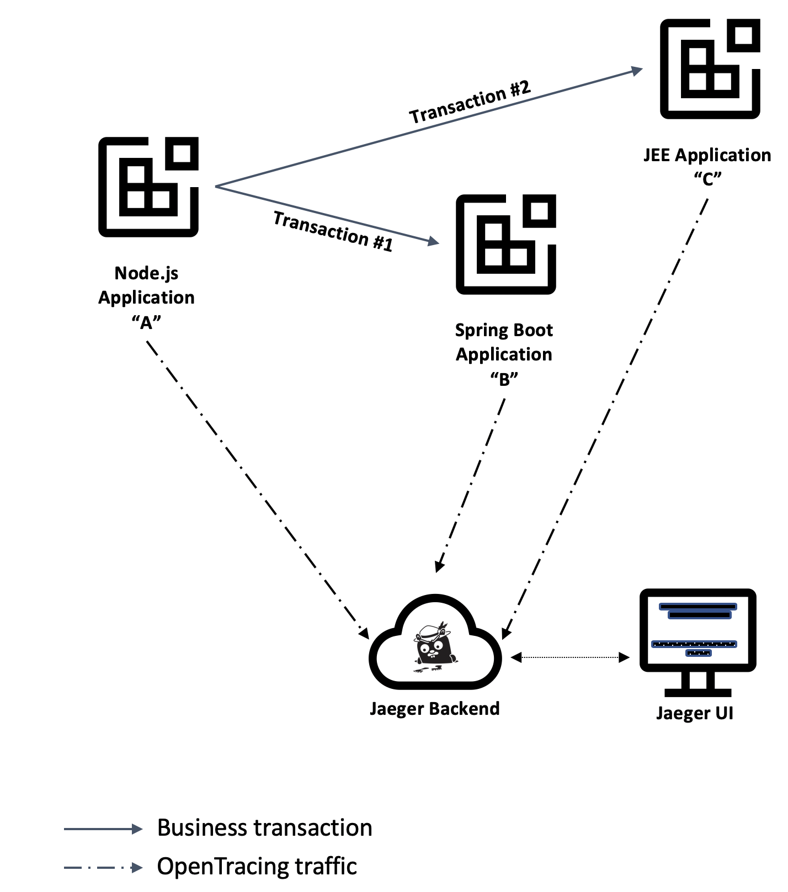
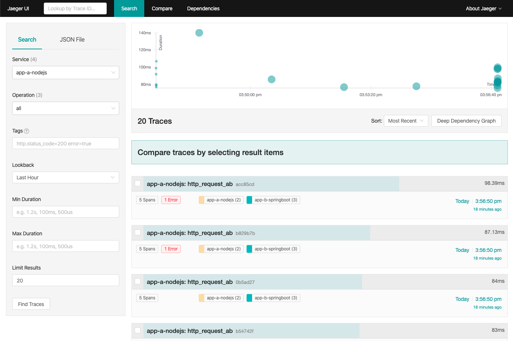

This is the first of a two-part tutorial, where you will build a small system containing various interconnected microservices and study the traffic inside that system. 

The first part focus on instrumenting the application for sending its traffic to a central location and then studying the results in a dashboard. The second part focus on the deployment of the resulting services to a Kubernetes cluster augmented with a service mesh, then exploring all the benefits of distributed tracing in a potential production environment. 

Traffic analysis is an essential activity in determining the ideal partitioning of function amongst components of the architecture and is also essential to understand the dynamics inside individual components.

This tutorial is meant for developers who are familiar with [Appsody](https://developer.ibm.com/blogs/introduction-to-appsody/) and with the concept of distributed tracing using [OpenTracing](https://opentracing.io/) APIs and the popular [Jaeger client libraries](https://www.jaegertracing.io/docs/latest/client-libraries/).

Appsody is one of the upstream open source projects included in [IBM Cloud Pak for Applications] (https://www.ibm.com/cloud/cloud-pak-for-applications) and is used in this tutorial to expedite the creation and testing of the microservices you are about to create.

At the end of the tutorial, you will have progressed through creating multiple microservices, instrumenting them for sending their telemetry to a [Jaeger](https://www.jaegertracing.io) backend (distributed tracing server) and studying the results in the Jaeger UI:



This [GitHub repository](https://github.com/IBM/icpa-opentracing) contains a copy of the final application after completion of all steps, which you can use as a reference throughout the 
tutorial.


## Traces and spans in OpenTracing

This tutorial is not meant as a primer on distributed tracing or OpenTracing, but this section covers the key concepts used throughout the next sections. [The OpenTracing Semantic Specification](https://github.com/opentracing/specification/blob/master/specification.md) remains the authoritative source on all terms and their definitions.


### Core concepts

You are encouraged to read the OpenTracing specification before continuing, but if pressed for time, the three essential distributed tracing concepts are "traces", "spans" and "references". At the most basic level, a "span" is the representation of a time-limited operation, whereas a "trace" is defined as an arbitrary collection of spans.

The other relevant concept is a "reference", which is used to represent the relationship between two spans, such as a span having a "children_of" relation to another span.

The [OpenTracing Data Model section](https://github.com/opentracing/specification/blob/master/specification.md#the-opentracing-data-model) of the specification illustrates that arrangement both in terms of the relationship between traces and spans, as well as their conceptual visualization in a timeline.


### A concrete example

In our example, and assuming Jaeger as a good example of tracing backend, consider an application "A" that receives a request from a web browser, on behalf of a user requesting the estimate for a purchase order.

Also, consider how that application "A" may invoke application "B" to quote each item in the order.

That application "A" could report a span covering the entire operation to the Jaeger backend and also pass the identifier of that span to application "B" so that when application "B" decides to create spans to represent its work in that business transaction, it can create a reference of type "children" between the new spans and the "parent" span created by application A".

The entire collection of spans created by both applications to represent that one transaction would be logically grouped as a single trace in the Jaeger backend and presented as such in the Jaeger UI.

The next figure illustrates the arrangement between the components and the resulting "trace" in the Jaeger backend, with each bar representing the duration of a span over a horizontal time axis: 


### OpenTracing converging into OpenTelemetry

The field of distributed tracing tooling and instrumentation is changing rapidly with the convergence of [OpenTracing](https://opentracing.io/) into [OpenTelemetry](https://opentelemetry.io). 

This tutorial is based on the (currently) more stable OpenTracing-based client libraries but will be updated once OpenTelemetry client libraries become more widely available.

In the meantime, these are good references to learn more about the convergence roadmap and its implications to the Jaeger infrastructure used in this tutorial:

- [Merging OpenTracing and OpenCensus: A Roadmap to Convergence](https://medium.com/opentracing/a-roadmap-to-convergence-b074e5815289)

- [Jaeger and OpenTelemetry](https://medium.com/jaegertracing/jaeger-and-opentelemetry-1846f701d9f2)


## Prerequisites

* [Install Docker](https://docs.docker.com/get-started/).
  If using Windows or macOS, Docker Desktop is probably the best choice. If using a Linux system, [minikube](https://github.com/kubernetes/minikube) and its internal Docker registry is an alternative.

* [Install the Appsody CLI](https://appsody.dev/docs/getting-started/installation).

* Install Kubernetes. [minikube](https://github.com/kubernetes/minikube) will work on most platforms, but if using Docker Desktop, the internal Kubernetes enabled from the Docker Desktop Preferences (macOS) or Settings (Windows) panel is a more convenient alternative.


## Estimated time

With the prerequisites in place, you should be able to complete this tutorial in 1 hour.


## Steps

Following along to this tutorial, you will perform the following steps:

1. Set up the local development environment
1. Create the Node.js application
1. Create the JEE application
1. Create the Spring boot application
1. Create the microservice dependencies
1. Examining tracing results
1. Teardown the deployment


## Step 1. Set up the local development environment

You will start with a local [all-in-one Jaeger server](https://www.jaegertracing.io/docs/getting-started/) installation as you progress through the steps in this tutorial. 

This all-in-one server acts as the backend for receiving the telemetry data from the various servers participating in a distributed transaction, as well as the host for the Jaeger UI console from where you can inspect the results of each transaction.


### Create a custom Docker network

This tutorial has many applications that need to locate each other via name lookups, which is easier when using a custom Docker network instead of the default bridge network.

Execute the following command from a command-line terminal:

```sh
docker network create opentrace_network
```

### Start a local Jaeger server

The instructions in the tutorial expect the all-in-one server to be named "jaeger-collector", which needs to be specified as the parameter when creating the container.

Type the following starting command from a command-line terminal, observing the presence of the `network` parameter cross-referencing the Docker network you just created:

```sh
docker run --name jaeger-collector \
  --detach \
  --rm \
  -e COLLECTOR_ZIPKIN_HTTP_PORT=9411 \
  -p 5775:5775/udp \
  -p 6831:6831/udp \
  -p 6832:6832/udp \
  -p 5778:5778 \
  -p 16686:16686 \
  -p 14268:14268 \
  -p 9411:9411 \
  --network opentrace_network \
  jaegertracing/all-in-one:latest
```

### Jaeger tracing options

The configuration for the Jaeger client libraries is well-documented in the Jaeger [Client Library Features](https://www.jaegertracing.io/docs/latest/client-features/) page and you need to define a few of those properties to feed the microservices.

Create a file for the Jaeger client properties, named `jaeger.properties`:

```properties
cat > jaeger.properties << EOF
JAEGER_ENDPOINT=http://jaeger-collector:14268/api/traces
JAEGER_REPORTER_LOG_SPANS=true
JAEGER_SAMPLER_TYPE=const
JAEGER_SAMPLER_PARAM=1
JAEGER_PROPAGATION=b3
EOF
```

There are a couple of special remarks about the contents of this configuration file:

- If you read through the [Jaeger architecture](https://www.jaegertracing.io/docs/latest/architecture/) page, the `JAEGER_ENDPOINT` variable instructs the client library to send span data directly to the Jaeger collector process instead of sending it to the intermediary agent process. This is an arbitrary decision for this tutorial and has no impact on the outcome in the Jaeger database. In a real production environment, there may be reasons to aggregate traffic through a Jaeger agent, but that discussion is outside the scope of this tutorial. 

- The combination of the `JAEGER_SAMPLER_TYPE` and `JAEGER_SAMPLER_PARAM` values is instructing the Jaeger client library to send every span to the Jaeger backend. This approach is appropriate for a tutorial where we want to inspect each trace, but it may negatively affect the performance of the system in a real production environment. Refer to the Jaeger documentation on [sampling](https://www.jaegertracing.io/docs/sampling/) to make an informed decision about the ideal sampling settings for your environment.


## Step 2. Create the Node.js application

Create the Node.js application using the Appsody command-line interface. Appsody supports both [Express](https://expressjs.com/) and [LoopBack](https://loopback.io/) frameworks. For this tutorial, you will use the Express framework.

Type the following command in the command-line interface:

```sh
tutorial_dir=$(PWD)
mkdir nodejs-tracing
cd nodejs-tracing
appsody init incubator/nodejs-express
```

This `tutorial_dir` variable will be referenced and reused later in the tutorial, so keep that location handy for when we need to reference the `jaeger.properties` file.

Take a moment to inspect the structure of the template application created by Appsody:

```
nodejs-tracing
├── app.js
├── package-lock.json
├── package.json
└── test
    └── test.js
```


### Assign a name to the application

Since you want to identify the contributors of spans in a trace, the first modification to the application is to change its name inside the newly generated `package.json` file.

Modify the line containing `"name": "nodejs-express-simple",` in `package.json` to this line instead:

```json
    "name": "app-a-nodejs",
```

### Enable OpenTracing using the Jaeger client library

For this section, you will follow instructions similar to those outlined in the [Jaeger documentation](https://github.com/jaegertracing/jaeger-client-node), which are listed in the next steps.

The first change is to include the `jaeger-client` package in your application, where you need to include the [package dependency](https://www.npmjs.com/package/jaeger-client) to the `package.json` file of the Node.js application, as follows:

```json
  "dependencies": {
    "jaeger-client": "^3.17.1"
  },
```

The Node.js Express framework does not automatically instrument RESTful calls for tracing, so you need to make a few changes to the `app.js` file to initialize an OpenTracing `tracer` object that can be used to make calls to the distributed tracing backend.

The changes are summarized as follows:

1. Insert a global initialization block for an OpenTracing tracer object
2. Initiate a tracing span at the beginning of the request
3. Add the tracing statements inside the handler for the RESTful request being traced.

You can see the changes outlined in the listing of the `app.js` file below, inside comment blocks marked "Tutorial begin" and "Tutorial end".

Either recreate the changes in the local `app.js` in your filesystem or copy-paste the contents below into that file.

```js
module.exports = (/*options*/) => {
  // Use options.server to access http.Server. Example with socket.io:
  //     const io = require('socket.io')(options.server)
  const app = require('express')()

  //
  // Tutorial begin: Global initialization block
  //
  var initTracerFromEnv = require('jaeger-client').initTracerFromEnv;
  var config = {
    serviceName: 'app-a-nodejs',
  };
  var options = {
  };
  var tracer = initTracerFromEnv(config, options);
  //
  // Tutorial end: Global initialization block
  //
  
  app.get('/', (req, res) => {
    //
    // Tutorial begin: OpenTracing new span
    //
    const span = tracer.startSpan('http_request');
    //
    // Tutorial end: OpenTracing new span
    //

    // Use req.log (a pino instance) to log JSON:
    req.log.info({message: 'Hello from Appsody!'});
    res.send('Hello from Appsody!');

    //
    // Tutorial begin: Send span information to Jaeger
    //
    span.log({'event': 'request_end'});
    span.finish();
    //
    // Tutorial end: Send span information to Jaeger
    //
  });

  return app;
};
```

You can find more information about the `tracer` interface in the [OpenTracing API page](https://github.com/opentracing/opentracing-javascript/).


### Launch the application

With the modifications to `package.json` and `app.js` in place, launch the application and validate that it is instrumented for tracing distributed transactions.

Type the following command on a separate command-line window:

```sh
appsody run \
  --name "nodejs-tracing" \
  --docker-options="--env-file ../jaeger.properties" \
  --network opentrace_network 
```

Note the usage of the `network` parameter to place the container in the same custom Docker network (`opentrace_network`) created at the beginning of the tutorial.

You should see a message such as the one below indicating that the server is ready to accept requests:

`[Container] App started on PORT 3000`

Once you see the message, you should open a new command-line terminal and issue a few requests to the sample resource in `app.js`.

```
curl http://localhost:3000
```

You can then launch the Jaeger UI in your browser of choice, by opening this URL:

http://localhost:16686

Choose the `app-a-nodejs` application in the Service menu and then click on the "Find Traces" button, which should display the transactions you initiated from the command-line:


## Step 2. Create the Spring Boot application

It is time to create the Spring Boot application, once again using the Appsody command-line interface. Open another command-line terminal, switch it to the directory where you created the `jaeger.properties` file in the first step, then type the following command in the command-line interface:

```sh
cd "${tutorial_dir}"
mkdir springboot-tracing
cd springboot-tracing
appsody init incubator/java-spring-boot2
```

Before making modifications to the application, take a moment to inspect the template application created by Appsody:

```
springboot-tracing
├── mvnw
├── mvnw.cmd
├── pom.xml
└── src
    ├── main
    │   ├── java
    │   │   └── application
    │   │       ├── LivenessEndpoint.java
    │   │       └── Main.java
    │   └── resources
    │       ├── application.properties
    │       └── public
    │           └── index.html
    └── test
        └── java
            └── application
                └── MainTests.java
```


### Assign a name to the application

Since you want to identify this application while inspecting a tracing span, the first modification is to change the application name inside the newly generated `pom.xml` file.

Modify the line containing `<artifactId>default-application</artifactId>` in `pom.xml` to this line instead:

```xml
    <artifactId>app-b-springboot</artifactId>
```


### Enable OpenTracing using Jaeger client

For this section, you will follow instructions similar to those outlined in the [Jaeger client library for Spring Boot](https://github.com/opentracing-contrib/java-spring-jaeger).

The first modification is to enable OpenTracing within the Spring Boot runtime, which requires a couple of localized changes to the `pom.xml` file.

Insert the Maven dependencies for Jaeger and OpenTracing inside the `<dependencies>` element of the `pom.xml` file:

```xml
    <dependency>
        <groupId>io.opentracing.contrib</groupId>
        <artifactId>opentracing-spring-cloud-starter</artifactId>
        <version>0.4.0</version>
    </dependency>

    <dependency>
        <groupId>io.opentracing</groupId>
        <artifactId>opentracing-api</artifactId>
        <version>0.33.0</version>
    </dependency>

    <dependency>
        <groupId>io.jaegertracing</groupId>
        <artifactId>jaeger-client</artifactId>
        <version>1.1.0</version>
    </dependency>
```


### Enable OpenTracing

The Jaeger client library needs to be initialized once in the source code, which you will perform at the beginning of the program execution.

Repeat the changes outlined in the fully modified example below to the `./src/main/java/application/Main.java` in the source tree for your Spring Boot application:

```java
package application;

import org.springframework.boot.SpringApplication;
import org.springframework.boot.autoconfigure.SpringBootApplication;

// 
// Tutorial: Begin import statements for Jaeger and OpenTracing
//
import org.springframework.context.annotation.Bean;
import io.jaegertracing.Configuration;
import io.opentracing.Tracer;
// 
// Tutorial: End import statements for Jaeger and OpenTracing
//

@SpringBootApplication
public class Main {

        // 
        // Tutorial: Begin initialization of OpenTracing tracer
        //
        @Bean
        public Tracer initTracer() {
          return Configuration.fromEnv("app-b-springboot").getTracer();
        }
        // 
        // Tutorial: End initialization of OpenTracing tracer
        //

        public static void main(String[] args) {
                SpringApplication.run(Main.class, args);
        }

}
```


### Launch the application

With the modification in place, it is time to launch the application and validate that it is instrumented for tracing distributed transactions.

Type the following command on a separate command-line window:

```sh
appsody run \
  --name springboot-tracing \
  --docker-options="--env-file ../jaeger.properties" \
  --network opentrace_network 
```

Note the usage of the `network` parameter again, placing the container in the same custom Docker network created at the beginning of the tutorial.

You should see a message such as the one below indicating that the server is ready to accept requests:

`[Container] ... INFO ... [  restartedMain] application.Main : Started Main...`

Once you see the message issue a few requests to the application. Any URL will be sufficient for now as the goal is to validate that the OpenTracing enablement is working before you move on to create new endpoints, so that you will use the `actuator` endpoint already pre-built into the application template.

Enter the following command in a command-line terminal and repeat it a few times.

```
curl http://localhost:8080/actuator
```

Now return to [Jaeger UI](http://localhost:16686) in your web browser. You will need to refresh the screen to see the new service entry for the application (`app-b-springboot`) in the "Service" menu.

Choose the `app-b-springboot` application in the "Service" menu and then click on the "Find Traces" button, which will display the spans created as part of the transactions you initiated from the command-line:


## Step 4. Create the JEE application

As the last application in our example microservices architecture, create a JEE application and instrument it with tracing capabilities.

Create a working skeleton of a JEE application using the Open Liberty server. Open a new command-line terminal and switch to the directory where you created the `jaeger.properties` file earlier in the tutorial, then type the following commands:

```sh
cd "${tutorial_dir}"
mkdir jee-tracing
cd jee-tracing
appsody init incubator/java-openliberty
```

Before making any modifications to the application, take a moment to inspect the template application created by Appsody:

```
java-openliberty
├── pom.xml
└── src
    ├── main
    │   ├── java
    │   │   └── dev
    │   │       └── appsody
    │   │           └── starter
    │   │               ├── StarterApplication.java
    │   │               ├── StarterResource.java
    │   │               └── health
    │   │                   ├── StarterLivenessCheck.java
    │   │                   └── StarterReadinessCheck.java
    │   ├── liberty
    │   │   └── config
    │   │       └── server.xml
    │   └── webapp
    │       ├── WEB-INF
    │       │   └── beans.xml
    │       └── index.html
    └── test
        └── java
            └── it
                └── dev
                    └── appsody
                        └── starter
                            └── HealthEndpointTest.java
```


### Assign a name to the application

Since you want to easily identify this application while inspecting a tracing span, the first modification to the application is to change the application name inside the newly generated `pom.xml` file.

Modify the line containing `<artifactId>starter-app</artifactId>` in `pom.xml` to this line instead:

```xml
    <artifactId>app-c-jee</artifactId>
```

### Enable OpenTracing using Jaeger client

The next modification is to enable OpenTracing within the Open Liberty runtime, which requires a couple of localized changes to both the `pom.xml` and `src/main/liberty/config/server.xml` files.

The nature of these changes is explained in a bit more detail in the [Open Liberty blog entry announcing the support of Jaeger as a tracing backend](https://openliberty.io/blog/2019/12/06/microprofile-32-health-metrics-190012.html#jmo).

The first change is to include the [Jaeger Java client library](https://github.com/jaegertracing/jaeger-client-java) dependency in the final application. 

Insert the [Maven jaeger-client dependency](https://mvnrepository.com/artifact/io.jaegertracing/jaeger-client) XML element inside the `<dependencies>` element of the `pom.xml` file:

```xml
        <dependency>
            <groupId>io.jaegertracing</groupId>
            <artifactId>jaeger-client</artifactId>
            <version>0.34.0</version>
        </dependency>
```

Note that this version of the Jaeger client library, while not the latest version, is the version tested with the version of Open Liberty bundled in the Appsody `java-openliberty` stack at the time this tutorial was written. See notes in the [Troubleshooting](#troubleshooting) section about common problems experienced while attempting to use different versions.

The next step is to add the OpenTracing feature to the Open Liberty server. Add the following element inside the `featureManager` section of the `src/main/liberty/config/server.xml` file:

```xml
        <feature>mpOpenTracing-1.3</feature>
```

Replace the `webApplication` element in the `src/main/liberty/config/server.xml` file with this snippet:

```xml
    <webApplication location="app-c-jee.war" contextRoot="/" >
        <classloader apiTypeVisibility="+third-party" />
    </webApplication>
```

About the last change, the Open Liberty documentation instructs you to create a new shared library available to all applications running inside the Open Liberty server, but that level of complexity is unnecessary for the microservice created in this tutorial since there will be a single application inside that server.

This complements the basic instrumentation of the JEE application, with the Open Liberty stack offering a solid baseline for distributed tracing, with every remote request being instrumented without code changes.

That default behavior can be altered through Java annotations present in the [Eclipse MicroProfile OpenTracing specification](https://github.com/eclipse/microprofile-opentracing/blob/master/spec/src/main/asciidoc/microprofile-opentracing.asciidoc), some of which is explored later in the tutorial.


### Launch the application

With the modifications to the `pom.xml` and `server.xml` files in place, it is time to launch the application and validate that it is instrumented for tracing distributed transactions.

Type the following command on a separate command-line window:

```sh
appsody run \
  --name jee-tracing \
  --publish "9444:9443" \
  --docker-options="--env-file ../jaeger.properties" \
  --network opentrace_network 
```

Once again, notice the `network` parameter to place the container in the same custom Docker network created at the beginning of the tutorial. You can inspect the other Jaeger configuration parameters in the [Jaeger documentation for the Java client library](https://github.com/jaegertracing/jaeger-client-java/blob/master/jaeger-core/README.md).

Also, notice the usage of the `--publish` parameter to export port 9444 instead of 9443 to the localhost. This change is required to bypass a common network port conflict in the development environments where Docker has the Kubernetes cluster enabled and already using port 9443.

You should see a message such as the one below indicating that the server is ready to accept requests:

```
[Container] [INFO] [AUDIT   ] CWWKF0011I: The defaultServer server is ready to run a smarter planet...
...
[Container] [INFO] Integration tests finished.
```

Once you see the message, issue a few requests to the sample resource created along with the application.

```sh
curl http://localhost:9080/starter/resource
```

Now return to the [Jaeger UI](http://localhost:16686) in your browser, refreshing the browser screen once more to see the new service entry for the application (`app-c-jee`).

Choose the `app-c-jee` application in the Service menu and then click on the "Find Traces" button again, which should display the transactions you initiated from the command-line:


## Step 5. Create the microservice dependencies

At this point in the tutorial, you have the 3 standalone microservices running and enabled to send their tracing information to the Jaeger all-in-one server. You can proceed to create the dependencies between these microservices, materializing the microservices topology depicted at the beginning of the tutorial.


### Service endpoint in the Open Liberty application

This new endpoint implements a typical JAX-RS REST resource, with the addition of OpenTracing API calls to create spans while the request is being processed. One of the spans is implicit in the invocation of the external REST handler, while a couple of others are created explicitly inside that method to illustrate the full potential of distributed tracing bridging together both inter-process and intra-process spans of an entire distributed transaction.

Create a new Java class named `ServiceResource.java` in the `src/main/java/dev/appsody/starter` folder of the Spring Boot application, containing the source code below:

```java
package dev.appsody.starter;

import javax.inject.Inject;
import javax.json.Json;
import javax.json.JsonObject;
import javax.ws.rs.GET;
import javax.ws.rs.Path;
import javax.ws.rs.Produces;
import javax.ws.rs.core.Context;
import javax.ws.rs.core.HttpHeaders;
import javax.ws.rs.core.MediaType;
import javax.ws.rs.core.MultivaluedMap;
import javax.ws.rs.core.Response;

import io.opentracing.Scope;
import io.opentracing.Tracer;
import io.opentracing.tag.Tags;

@Path("/service")
public class ServiceResource {

    @Inject
    Tracer tracer;

    @GET
    @Produces(MediaType.APPLICATION_JSON)
    public Response completeOrder(JsonObject orderPayload, @Context HttpHeaders httpHeaders) {
        try (Scope childScope = tracer.buildSpan("phase_1").startActive(true)) {
            MultivaluedMap<String, String> requestHeaders = httpHeaders.getRequestHeaders();
            requestHeaders.forEach((k, v) -> System.out.println(k + ":" + v.toString()));
            System.out.println(orderPayload);
            System.out.println("baggage item: " + tracer.activeSpan().getBaggageItem("baggage"));
        }

        try (Scope childScope = tracer.buildSpan("phase_2").startActive(true)) {
            double orderTotal = orderPayload.getJsonNumber("total").doubleValue();
            if (orderTotal > 6000) {
                childScope.span().setTag(Tags.ERROR.getKey(), true);
                childScope.span().log("Order value " + orderTotal + " is too high");
            }
            // Simulation of long stretch of work
            Thread.sleep(60);
        } catch (InterruptedException e) {
            // no-op
        }

        JsonObject response = Json.createObjectBuilder().add("status", "completed")
                .add("order", orderPayload.getString("order")).build();
        return Response.ok(response).build();
    }
}
```

There is no need to take action on the `appsody run` command already running the application since `appsody` will automatically detect the new code changes, recompile the application, and then restart it with the new code within the same container.

Monitor the log entries in the terminal where the application was started.


### Create service endpoint in the Sprint Boot application

This endpoint is similar in concept to the endpoint created for the Open Liberty application, with the expected adaptations of REST annotations to match the Spring Boot programming model. Once again, one of the spans is implicit in the invocation of the external REST handler, while a couple of others are created explicitly inside the handler.

Create a new Java class named `ServiceResource.java` in the `src/main/java/application` folder of the Spring Boot application, containing the following source code:

```java
package application;

import java.util.Map;
import java.util.Random;

import org.springframework.beans.factory.annotation.Autowired;
import org.springframework.http.HttpHeaders;
import org.springframework.http.MediaType;
import org.springframework.http.ResponseEntity;
import org.springframework.web.bind.annotation.GetMapping;
import org.springframework.web.bind.annotation.RequestBody;
import org.springframework.web.bind.annotation.RequestHeader;
import org.springframework.web.bind.annotation.RestController;

import io.opentracing.Span;
import io.opentracing.Tracer;
import io.opentracing.tag.Tags;

@RestController
public class ServiceResource {

    @Autowired
    private Tracer tracer;

    @GetMapping(value = "/resource", consumes = "application/json", produces = "application/json")
    public ResponseEntity<Object> quoteItem(@RequestBody Map<String, Object> quotePayload,
        @RequestHeader HttpHeaders  httpHeaders) {

        Span parentSpan = tracer.scopeManager().activeSpan();
        Span spanPhase1 = tracer.buildSpan("phase_1").asChildOf(parentSpan).start();
        try {
            httpHeaders.forEach((k, v) -> System.out.println(k + ":" + v.toString()));
            quotePayload.forEach((k, v) -> System.out.println(k + ":" + v.toString()));
            System.out.println("baggage:" + parentSpan.getBaggageItem("baggage"));
        } finally {
            spanPhase1.finish();
        }

        Span spanPhase2 = tracer.buildSpan("phase_2").asChildOf(parentSpan).start();
        try {
            int orderTotal = (Integer) quotePayload.getOrDefault("count", 0);
            if (orderTotal > 7) {
                spanPhase2.setTag(Tags.ERROR.getKey(), true);
                spanPhase2.log("Out of stock for item " + quotePayload.get("itemId"));
            }
            try {
                // Simulate long stretch of work
                Thread.sleep(60);
            } catch (InterruptedException e) {
                // no-op
            }
        } finally {
            spanPhase2.finish();
        }

        return ResponseEntity
          .ok().contentType(MediaType.APPLICATION_JSON)
          .body("{ \"quote\", " + new Random().nextFloat() + " }");
    }
}
```


### Create the top-level service endpoint in the Node.js application

Recalling the original goal of this tutorial, it is time to create the top-level service endpoints in the Node.js application, which makes the down-stream calls to the other applications.

As a first step, modify the `dependencies` element created earlier in the `package.json` file and include the other Node.js packages required in the actual service endpoint source code.

Modify the `dependencies` element in `package.json` so that it looks like this:

```json
  "dependencies": {
    "jaeger-client": "^3.17.1",
    "opentracing": "latest",
    "request-promise": "^4.2.0",
    "uuid-random": "latest"
  },
```

Until [GitHub issue #583](https://github.com/appsody/stacks/issues/583) is addressed, Appsody does not automatically restart Node.js applications upon changes to the `package.json` file, so you need to manually stop the application, by pressing the combination of the `Ctrl+C` keys in the command-line terminal from where you started the Node.js application.

Once the application is stopped, reissue the `appsody start` command from that same terminal:

```sh
appsody run \
  --docker-options="--env-file ../jaeger.properties" \
  --network opentrace_network 
```

Now create a new file named `serviceBroker.js` in the same directory where you created the Node.js project, with the following contents:

```js
// serviceBroker.js
// ================

const request = require('request-promise');
const { Tags, FORMAT_HTTP_HEADERS } = require('opentracing');

var serviceTransaction = function(serviceCUrl, servicePayload, parentSpan) {
    const tracer = parentSpan.tracer();
    const span = tracer.startSpan("service", {childOf: parentSpan.context()});
    var callResult = callService(serviceCUrl, servicePayload, span)
        .then( data => {
            span.setTag(Tags.HTTP_STATUS_CODE, 200)
            span.finish();
        })
        .catch( err => {
            console.log(err);
            span.setTag(Tags.ERROR, true)
            span.setTag(Tags.HTTP_STATUS_CODE, err.statusCode || 500);
            span.finish();
        });
    return callResult;
}

async function callService(serviceCUrl, servicePayload, parentSpan) {
    const tracer = parentSpan.tracer();
    const url = serviceCUrl;
    const body = servicePayload

    const span = parentSpan;
    const method = 'GET';
    const headers = {};
    span.setTag(Tags.HTTP_URL, serviceCUrl);
    span.setTag(Tags.SPAN_KIND, Tags.SPAN_KIND_RPC_CLIENT);
    span.setBaggageItem("baggage", true);
    tracer.inject(span, FORMAT_HTTP_HEADERS, headers);

    var serviceCallOptions = {
        uri: url,
        json: true,
        headers: headers,
        body: servicePayload
    };
    try {
        const data = await request(serviceCallOptions);
        span.finish();
        return data;
    }
    catch (e) {
        span.setTag(Tags.ERROR, true)
        span.finish();
        throw e;
    }

}

module.exports = serviceTransaction;
```

This service call creates a distributed tracing span (named `service`) to delimit an outbound call to a remote application. Notice the [tracer.inject](https://opentracing-javascript.surge.sh/classes/tracer.html#inject) call before that outbound call, populating the HTTP headers so that the span context is propagated to the remote application. 

The next modifications, to be made against the `app.js` file, are somewhat spread out across the file, so it is easier to replace the entire contents of the file with the content below, taking a moment to inspect the code blocks between "Tutorial begin" and "Tutorial end" comments to understand the purpose of the changes:


```js
module.exports = (/*options*/) => {
  // Use options.server to access http.Server. Example with socket.io:
  //     const io = require('socket.io')(options.server)
  const app = require('express')()

  //
  // Tutorial begin: Remote requests to other applications
  //
  const uuid = require('uuid-random')
  const serviceTransaction = require('./serviceBroker.js')
  //
  // Tutorial end: Remote requests to other applications
  //
  
  //
  // Tutorial begin: OpenTracing initialization
  //
  const opentracing = require('opentracing')
  var initTracerFromEnv = require('jaeger-client').initTracerFromEnv
  var config = { serviceName: 'app-a-nodejs' }
  var options = {}
  var tracer = initTracerFromEnv(config, options)
  
  // This block is required for compatibility with the service meshes 
  // using B3 headers for header propagation
  // https://github.com/openzipkin/b3-propagation
  const ZipkinB3TextMapCodec = require('jaeger-client').ZipkinB3TextMapCodec
  let codec = new ZipkinB3TextMapCodec({ urlEncoding: true });
  tracer.registerInjector(opentracing.FORMAT_HTTP_HEADERS, codec);
  tracer.registerExtractor(opentracing.FORMAT_HTTP_HEADERS, codec);

  opentracing.initGlobalTracer(tracer)
  //
  // Tutorial end: OpenTracing initialization
  //
  
  app.get('/', (req, res) => {
    // Use req.log (a pino instance) to log JSON:
    req.log.info({message: 'Hello from Appsody!'})
    res.send('Hello from Appsody!')
  })

  // Tutorial begin: Transaction A-B 
  app.get('/node-springboot', (req, res) => {
    const baseUrl = 'http://springboot-tracing:8080'
    const serviceCUrl = baseUrl + '/resource'
    const spanName = 'http_request_ab'
 
    // https://opentracing-javascript.surge.sh/classes/tracer.html#extract
    const wireCtx = tracer.extract(opentracing.FORMAT_HTTP_HEADERS, req.headers)
    const span = tracer.startSpan(spanName, { childOf: wireCtx })
    span.log({ event: 'request_received' })

    const payload = { 'itemId': uuid(), 'count': Math.floor(1 + Math.random() * 10)}
    serviceTransaction(serviceCUrl, payload, span)
      .then(() => {
        const finishSpan = () => {
          span.log({'event': 'request_end'})
          span.finish()
        }

        res.on('finish', finishSpan)

        req.log.info({message: spanName})
        res.send(payload)
      })
  })
  // Tutorial end: Transaction A-B

  // Tutorial begin: Transaction A-C
  app.get('/node-jee', (req, res) => {
    const baseUrl = 'http://jee-tracing:9080'
    const serviceCUrl = baseUrl + '/starter/service'
    const spanName = 'http_request_ac'

    const wireCtx = tracer.extract(opentracing.FORMAT_HTTP_HEADERS, req.headers)
    const span = tracer.startSpan(spanName, { childOf: wireCtx })
    span.log({ event: 'request_received' })

    const payload = { 'order': uuid(), 'total': Math.floor(1 + Math.random() * 10000)}
    serviceTransaction(serviceCUrl, payload, span)
      .then(() => {
        const finishSpan = () => {
          span.log({'event': 'request_end'})
          span.finish()
        }

        res.on('finish', finishSpan)

        req.log.info({message: spanName})
        res.send(payload)
      })
  })
  // Tutorial end: Transaction A-C

  return app
}
```

As you create the new `serviceBroker.js` file and replace the contents of `app.js`, notice how Appsody restarts the application automatically to reflect the changes in the actual service.

The previous steps conclude the creation of the microservices in the distributed architecture proposed at the beginning of the tutorial, so you can proceed to validate the results and interact with the tracing data generated as a byproduct of business transactions.


## Step 6. Visualizing the distributed transactions

Issue multiple requests to the new endpoints in the Node.js application, repeating the following instructions a few times from the command-line terminal:

```sh
for i in {1..20}
do
  curl -s http://localhost:3000/node-jee
  sleep 1
  curl -s http://localhost:3000/node-springboot
  sleep 1
done
```

Now go back to the [Jaeger UI](http://localhost:16686) to inspect the new traces. Select `app-a-nodejs` from the "Service" menu and click on the "Find Traces" button.

You should see a trace for each of the requests issued from the command line.



Now click on one of the trace entries, preferably one tagged with the `1 Error` marker, which is set within the Spring Boot and JEE service endpoints depending on the values in the input values for the request. Take a couple of moments to expand the span segments and inspect their contents.


Notice how the span contents, such as tags and log entries, corresponding to the OpenTracing calls made in the endpoints.


### Inspecting HTTP headers for distributed tracing

The Spring Boot and JEE microservices were instrumented to print out all incoming headers for their service points. You can take a closer look at the output of both microservices and see the tracing HTTP headers passed from the source application.

The terminal window for the Spring Boot application should contain output similar to this for each request, with possibly different orders for the fields:

```
[Container] host:[springboot-tracing:8080]
[Container] accept:[application/json]
[Container] content-type:[application/json]
[Container] content-length:[59]
[Container] connection:[close]
[Container] uberctx-baggage:[true]
[Container] x-b3-traceid:[d9fb3e70bfecee44]
[Container] x-b3-parentspanid:[d9fb3e70bfecee44]
[Container] x-b3-spanid:[958c39d355a34341]
[Container] x-b3-sampled:[1]
```

The terminal window for the Open Liberty application should contain output similar to this for each request, with possibly different orders for the fields:

```
[Container] [INFO] Accept:[application/json]
[Container] [INFO] connection:[close]
[Container] [INFO] Content-Length:[61]
[Container] [INFO] content-type:[application/json]
[Container] [INFO] Host:[jee-tracing:9080]
[Container] [INFO] uberctx-baggage:[true]
[Container] [INFO] x-b3-parentspanid:[a2e3fee65e0826c7]
[Container] [INFO] x-b3-sampled:[1]
[Container] [INFO] x-b3-spanid:[c3324648c101b7c9]
[Container] [INFO] x-b3-traceid:[a2e3fee65e0826c7]
```


## Step 7. Tearing down the installation

Use the following commands from a command-line terminal to stop all running processes created up to this point in the tutorial and then remove resources created by these processes:

```sh
appsody stop --name nodejs-tracing
appsody stop --name springboot-tracing
appsody stop --name jee-tracing
docker stop jaeger-collector
docker network rm opentrace_network
```


## Conclusion

You have reviewed the basic concepts about distributed tracing and its usefulness, instrumented a set of interconnected microservices to generate distributed tracing information as part of their regular business logic and inspected the transaction contents using a specialized user interface.

Along the way, you used Appsody as a supporting tool to create microservices without needing specialized Docker knowledge to create optimized containers across a small spectrum of programming languages and frameworks.

This foundation will be leveraged in the second part of the series, where the small microservices architecture built in this first part will be converted to Docker images and placed behind a service mesh running inside a Kubernetes cluster, offering more powerful mechanisms to study the application topology and its behavior inside an environment more likely to be found in a real production environment.


## Next steps

- Explore the [Istio Telemetry Addons](https://istio.io/docs/tasks/observability/gateways/)

- You can try these hands-on [service mesh labs](https://learn.openshift.com/servicemesh/), which contains a good list of basic and advanced lessons.


## Troubleshooting

These are some of the most common problems you may find in case you miss a step or attempt to improve upon some of the code and packaging mentioned in this tutorial.


### Choosing a different version of Jaeger client for java-openliberty stack

The Jaeger client depends on the OpenTracing libraries bundled with Open Liberty, which in turn is the core of the Appsody java-openliberty stack. At the time of the writing for this tutorial, the [recommended version](https://openliberty.io/blog/2019/12/06/microprofile-32-health-metrics-190012.html#jmo) is 0.34.0.

As the application code evolves, it is a good development practice to pick later versions of dependency libraries, but beware of these common problems when the Jaeger client version has conflicts with the OpenTracing libraries bundled with Open Liberty.

For instance, version 0.35.0 of the Jaeger client is incompatible with Open Liberty 19.0.0.12. The symptoms are failed RESTful requests accompanied by this message.

`Error 500: java.lang.NoSuchMethodError: io/opentracing/ScopeManager.activeSpan&#40;&#41;Lio/opentracing/Span&#59; &#40;loaded from file:/opt/ol/wlp/lib/../dev/api/third-party/com.ibm.websphere.appserver.thirdparty.opentracing.0.31.0_1.0.35.jar by org.eclipse.osgi.internal.loader.EquinoxClassLoader@377a1965[com.ibm.websphere.appserver.thirdparty.opentracing.0.31.0:1.0.35.cl191220191120-0300&#40;id=216&#41;]&#41; called from class io.jaegertracing.internal.JaegerTracer$SpanBuilder &#40;loaded from file:/mvn/repository/io/jaegertracing/jaeger-core/0.35.0/jaeger-core-0.35.0.jar by com.ibm.ws.classloading.internal.AppClassLoader@bb1ae24d&#41;.`

If you attempt the version 1.1.0, the RESTful request also fail, but this time with a more cryptic error message about classloading violations:

`java.lang.LinkageError: loading constraint violation: loader "org/eclipse/osgi/internal/loader/EquinoxClassLoader@233ffde8" previously initiated loading for a different type with name "io/opentracing/Tracer" defined by loader "com/ibm/ws/classloading/internal/AppClassLoader@ef963440"`

In summary, be on the lookout for these types of error messages as you attempt to use more recent versions of the Jaeger client in your application.


## Credits

- Thanks to my colleague Carlos Santana, who wrote the excellent ["Learning Distributed Tracing 101" tutorial](https://ibm-cloud-architecture.github.io/learning-distributed-tracing-101/docs/index.html), which was instrumental in helping me figure out the Node.js aspects of this tutorial.

- Thanks to Yuri Shkuro (the father of Jaeger) and Junmin Liu for the excellent [Node.js chapter of the OpenTracing tutorial](https://github.com/yurishkuro/opentracing-tutorial/tree/master/nodejs).
